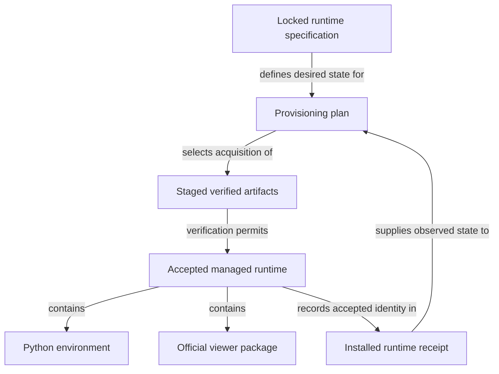

```concorde-document
{
  "id": "document.specs.modules.concorde.managed-runtime.module",
  "targets": [
    "module.managed-runtime"
  ],
  "main_visible": true
}
```

# Managed runtime

Provision and verify the pinned Python and viewer runtime used by installed integrations.

## Contract identity and context

`module.managed-runtime` follows Spec Protocol 2.0.0. Its sole structural parent is `module.concorde`. The complete contract is the Markdown collection explicitly registered in `.concorde/specs.json`; links and realization references do not expand it. This reading entry introduces the collection.

The registered companion documents explain [interfaces](interfaces.md). Their content remains authoritative regardless of navigation visibility.

## Architecture

Authored source: `specs/modules/concorde/managed-runtime/module.md` (the Mermaid fence in this section). Kind: `mermaid`. Title: **Managed runtime entities and relationships**. The source is included through this document’s explicit membership; it is not a separate external diagram record.



A locked runtime specification identifies Python, dependency and viewer requirements. An installed receipt describes previously accepted state. Planning compares the two and selects required actions; provisioning acquires and stages the exact specified artifacts before verifying and accepting a runtime.

The Python environment and official viewer are separate versioned components of the owned runtime. An incomplete acquisition is never an accepted installation. Reuse requires verified identity, and failed replacement restores previously valid owned state when recovery succeeds. This Module provisions runtime resources; a viewer launch or Agent task is a separate consumer operation.

## Features

### feature.managed-runtime.provide

For locked Python/viewer requirements and an accepted provisioning action, compare installed state, stage required artifacts, verify their identity and record the resulting owned runtime receipt. An unchanged verified runtime may be reused. Failed acquisition or verification must not replace a previously valid runtime or mark partial state usable.

## Interfaces

### api.runtime.provision

load_runtime_spec reads locked requirements. plan_runtime describes provisioning state. provision_runtime stages versioned, hash-bound inputs and records verified receipts. A failed acquisition does not replace a previously valid runtime or accept a partial installation.

The [local interface contract](interfaces.md) defines accepted inputs, outputs, effects, errors and compatibility. A successful shape check alone does not establish successful execution or a complete business contract.

## Boundary

This leaf Module has no registered child or direct software-Module dependency. Caller-supplied values and external runtime resources do not become structural children.

## Realizations

The registered realizations are `implementation.managed-runtime`. They describe exact file ownership and internal implementation choices separately. Module/Feature/Interface selection includes this full contract collection and does not load those Implementation Specs. Code writing and dedicated code review use their separately declared Framework authority.
