```concorde-document
{
  "id": "document.concorde.system",
  "targets": [
    "module.concorde"
  ],
  "main_visible": true
}
```

# Concorde Framework

Turn specified intent into inspectable changes, and distribute the tools and views needed to work with those changes.

## Contract identity and context

`module.concorde` follows Spec Protocol 2.0.0. It is the project entry Module. The complete contract is the Markdown collection explicitly registered in `.concorde/specs.json`; links and realization references do not expand it. This reading entry introduces the collection.

## Architecture

Authored source: `specs/modules/concorde/module.md` (the Mermaid fence in this section). Kind: `mermaid`. Title: **Concorde Framework entities and relationships**. The source is included through this document’s explicit membership; it is not a separate external diagram record.

```mermaid
flowchart TB
    accTitle: Concorde Framework entities and relationships
    accDescr: A developer request carries intent and constraints. Project Specs supply promised behavior; a candidate holds proposed changes and revision-bound evidence. Published views expose declared knowledge, while an existing code graph exposes observations. The independent Spec Protocol constrains Spec meaning and remains outside the Framework composition.
    developer["Developer"]
    protocol["Spec Protocol<br/>external normative standard"]
    framework["Concorde Framework<br/>module.concorde"]
    specs["Project Specs"]
    candidate["Candidate change and evidence"]
    developer -->|submits intent and constraints to| framework
    protocol -->|defines meaning of| specs
    framework -->|consumes| specs
    framework -->|produces| candidate
    framework -->|contains| workflows["Workflows"]
    framework -->|contains| installation["Installation"]
    framework -->|contains| context["Spec Context"]
    framework -->|contains| registry["Registry"]
    framework -->|contains| wire["Wire Contracts"]
    framework -->|contains| files["File Transactions"]
    framework -->|contains| execution["Agent Execution"]
    framework -->|contains| permissions["Permissions"]
    framework -->|contains| assets["Package Assets"]
    framework -->|contains| runtime["Managed Runtime"]
    framework -->|contains| reflections["Reflections"]
    framework -->|contains| publication["Publication"]
    framework -->|contains| viewer["Viewer"]
```



A developer request carries intent and constraints. Project Specs supply promised behavior; a candidate holds proposed changes and revision-bound evidence. Published views expose declared knowledge, while an existing code graph exposes observations. The independent Spec Protocol constrains Spec meaning and remains outside the Framework composition.

All thirteen contained software Modules have this Module as their sole structural parent. Workflows coordinates the change lifecycle using sibling context, registry, execution, permissions, wire, transaction, asset and feedback services. Installation composes setup and provisioning; Publication and Viewer provide the two developer views. A ready candidate ends development; only a separately authorized delivery can update the destination.

### Project diagram convention

Every Concorde Module MUST describe its principal entities and directed relationships with an inline Mermaid diagram in its `module.md` Architecture section. Labels, titles, descriptions and explanatory prose use English. Include an accessible title and description, and explain the relationships, cardinalities or state rules needed to read the diagram. Diagram nodes are domain concepts unless explicitly identified as Modules. This is a Concorde project convention under the tool-neutral Spec Protocol, not a change to the independent standard. Rendered SVG/HTML and navigation remain derived views.

## Features

### feature.concorde.provide

For a project adopting the Framework, expose installed Skills and deterministic maintenance commands that connect declared intent, complete Spec contexts, bounded execution and inspectable outcomes. Admission failures, missing contracts and incomplete changes remain explicit; a successful tool call does not by itself establish a completed change.

### feature.concorde.develop

Given intended behavior and constraints, route a change to its providing Module and coordinate specification, planning, implementation and required evidence in one candidate. Return ready only when the current candidate meets its configured completion conditions. Missing promises stop dependent work; failure preserves inspectable progress. Delivery requires its separately authorized transition.

### feature.concorde.inspect

Given a question or a requested view, expose authored Spec pages and declared relationships through Publication, a Spec-grounded answer through Workflows, or an existing raw code graph through Viewer. Reading does not mutate project contracts. Missing Spec promises, invalid publication inputs and unavailable graph/runtime inputs are reported by the selected interface.

### feature.concorde.adopt

Given an installation target and supported integration, preview and apply owned installation changes while preserving user content. Initialize only an uninitialized project, pin its accepted Protocol binding and record unspecified business behavior as a draft. Conflicting ownership or failed provisioning prevents successful adoption and triggers recovery of replaced owned state.

## Interfaces

### interface.concorde.use

The developer supplies a task, constraints and optionally a target/focus hint through an installed Skill; deterministic commands accept their documented project and integration options. The host returns a versioned capability result that distinguishes admission failure, execution failure and the domain outcome, or a command-specific exit status. Routing hints never grant file access. Read and preview operations do not mutate project state. Authoring, installation and delivery require their action-specific current preconditions; a failed call may leave an inspectable candidate but cannot claim successful delivery. Repeated reads use current inputs; repeated mutations re-admit saved state or require a fresh proposal, rather than silently replaying stale effects. Unsupported versions and integrations fail explicitly. The child agreements below state the locally relied-upon promises for each entry path.

### Developer entry selection

| Intent | Entry and completion |
| --- | --- |
| Ask about a Spec or route a task | `concorde-main` takes intent and optional target/focus hints; an answer or attributed limitation completes a query without mutation. |
| Develop a change | `concorde-dev-loop` takes task/constraints and optional authoring/review flags; completion is a ready candidate, with explicit skips where authorized. |
| Initialize a project | `concorde-init` proposes then applies initial configuration and an honest Module stub; an existing project cannot be overwritten. |
| Change integration settings | `concorde-configure` applies an explicit supported integration/enforcement configuration to an initialized project. |
| Check a candidate | `concorde-validate` records current deterministic evidence; a failed or stale check cannot establish readiness. |
| Deliver a candidate | `concorde-deliver` stages the selected change on an independent branch and removes its worktree by default; only a separate explicitly authorized request by the sole primary writer merges it into the primary branch. |
| Work with recorded feedback | `concorde-reflections-triage` selects explicit Module-owned reports/gaps; status is read-only and mutations follow their declared evidence and disposition conditions. |

Installed Skills use a single schema-3 capability invocation with `capability_id`, execute or
describe-policy mode, configuration and a version-1 typed request. Unsupported versions, malformed
requests and integration mismatch fail admission. The result reports succeeded, blocked, failed or
described; domain output still distinguishes a ready candidate, gap, conflict or completed answer.
Describe-policy reports the bound grant without launching an Agent. Standard execution can create
candidate state and invoke separately bounded Agents; only the admitted action can change files.

Human views are complementary entries: Publication presents registered contracts and declared
relationships; Viewer opens a preexisting raw code graph. A view or feedback comment does not itself
authorize code changes, claim Spec/code agreement or create a Reflection. The developer's explicit
intent and constraints determine a subsequent task.

## Local collaboration agreements

These entries describe the exact direct providers and children registered for this Module. They state relied-upon behavior without importing another Module’s documents.

```concorde-dependencies
[
  {
    "target_id": "module.workflows",
    "responsibility": "Route tasks and coordinate specification, planning, coding, review, topology changes and delivery.",
    "selection_condition": "When the Framework needs to answer a question, develop a candidate, evolve topology or deliver an authorized change.",
    "relied_upon_promises": [
      "The public boundary is a versioned TypedValue invocation of an installed concorde-* Skill. Global calls select the owning Module; lifecycle calls perform declared deterministic actions. A planner determines tasks from the selected Module Spec alone. Code writers additionally receive referenced Implementation Specs. Each stage reports its own completion and gaps; a completed component does not independently deliver the enclosing change."
    ]
  },
  {
    "target_id": "module.installation",
    "responsibility": "Install, initialize, configure and upgrade Concorde while preserving user-owned content.",
    "selection_condition": "When the Framework needs to install or update owned integrations, initialize a project or distribute this checkout.",
    "relied_upon_promises": [
      "The installer proposes owned file changes and applies accepted current proposals. Initialization creates a Module stub, an explicit registry and a pinned Protocol binding. Build produces assets; installation places and verifies them. Missing business facts remain explicit. Failed application or provisioning restores previously valid owned state."
    ]
  },
  {
    "target_id": "module.spec-context",
    "responsibility": "Resolve complete Module contracts, bind code-writing implementation context and validate explicit Spec structure.",
    "selection_condition": "When the Framework needs to resolve task context, assess local contract structure or initialize Spec state.",
    "relied_upon_promises": [
      "resolve_context selects one Module and its complete registered documents. Feature focus never trims the collection. Non-code phases do not receive Implementation Specs or source. The implementation phase adds only the referenced Implementation Specs and exact bound files. Membership, bytes, rules and admitted stage inputs determine context identity."
    ]
  },
  {
    "target_id": "module.registry",
    "responsibility": "Admit Module and Implementation identities, resolve document collections and look up exact file ownership and reuse.",
    "selection_condition": "When the Framework needs to resolve identities, exact membership and implementation ownership.",
    "relied_upon_promises": [
      "SpecRepository reads registry schema 2. select returns a Module descriptor. Implementation records form a separate index, file_implementations maps each declared file to one owner, and implementation_users maps each Implementation Spec to all using Modules. Lookups never follow a relationship to read another Spec body."
    ]
  },
  {
    "target_id": "module.wire-contracts",
    "responsibility": "Admit versioned structured values, offline schemas and safe project paths.",
    "selection_condition": "When the Framework needs to admit a versioned value, schema or safe project path.",
    "relied_upon_promises": [
      "TypedValue envelopes identify a type, version and data. Unknown fields, unsupported identities and malformed values fail admission. File-path helpers reject traversal and aliases. Schema validation is deterministic and offline; a validation error never grants a different context or fallback authority."
    ]
  },
  {
    "target_id": "module.file-transactions",
    "responsibility": "Apply exact multi-file changes with before-digest checks and rollback.",
    "selection_condition": "When the Framework needs to apply a current exact-file proposal with recovery.",
    "relied_upon_promises": [
      "file_change captures a current before-digest. apply_files accepts exact allowed paths, stages changes, rechecks originals and invokes verification. Invalid or stale preflight causes no replacement. A later failure restores changed original bytes and removes transaction-created files when recovery I/O succeeds; recovery failure remains explicit. Proposed content cannot expand the allowed set."
    ]
  },
  {
    "target_id": "module.agent-execution",
    "responsibility": "Execute separately bound Agent invocations through their Harness and admit typed results.",
    "selection_condition": "When the Framework needs to run an admitted Agent invocation and consume its typed outcome.",
    "relied_upon_promises": [
      "AgentProcessExecutor accepts a host-built LaunchSpecification, verifies the Agent/Harness binding and effective policy, starts the selected model integration and validates completion evidence. Exit code alone does not establish completion. Recursive invocations retain independent context, limits and typed handoffs."
    ]
  },
  {
    "target_id": "module.permissions",
    "responsibility": "Compile declared effects and host authority into reproducible execution permissions.",
    "selection_condition": "When the Framework needs to compile and enforce the authority of an invocation.",
    "relied_upon_promises": [
      "compile_policy intersects role paths and caller authority. Native renderers establish the resulting read, write, command and network boundaries or reject unsupported enforcement. Only a code-writing invocation may write its bound implementation files and admitted Implementation Spec documents; Module contracts remain immutable in that phase."
    ]
  },
  {
    "target_id": "module.package-assets",
    "responsibility": "Build deterministic Agent, Skill, Protocol, schema and documentation assets from authored sources.",
    "selection_condition": "When the Framework needs to render or check installed rule, instruction and schema assets.",
    "relied_upon_promises": [
      "build renders assets; write_build writes owned projections; check_build compares without changing the worktree. verify_fresh detects changed authoring sources. Module and Implementation kind definitions are distributed together. Generated assets are derived outputs and are never independent authoring sources."
    ]
  },
  {
    "target_id": "module.managed-runtime",
    "responsibility": "Provision and verify the pinned Python and viewer runtime used by installed integrations.",
    "selection_condition": "When the Framework needs to provision or verify the locked Python and viewer environment.",
    "relied_upon_promises": [
      "load_runtime_spec reads locked requirements. plan_runtime describes provisioning state. provision_runtime stages versioned, hash-bound inputs and records verified receipts. A failed acquisition does not replace a previously valid runtime or accept a partial installation."
    ]
  },
  {
    "target_id": "module.reflections",
    "responsibility": "Retain, investigate and resolve explicitly attributed project feedback and persistent gaps.",
    "selection_condition": "When the Framework needs to retain explicitly selected feedback or carry out its requested triage action.",
    "relied_upon_promises": [
      "The triage boundary selects explicit records by Module or local feature/interface identity. Status is read-only. Investigation runs in a separately bound code invocation. Verified findings and developer disposition determine further work; ordinary feedback does not automatically create a Reflection or enlarge its owner."
    ]
  },
  {
    "target_id": "module.publication",
    "responsibility": "Create navigable documentation and diagrams from registered Module and Implementation Specs.",
    "selection_condition": "When the Framework needs to build or scaffold human-readable Spec documentation.",
    "relied_upon_promises": [
      "concorde docsite proposes and applies site scaffolding. The site reads registry schema 2 and builds pages, navigation and relationship views from registered sources. Module composition, dependencies and implementation reuse are distinct edges. Each Module opens its module.md. Implementation pages expose their file bindings and using Modules. Only a complete current candidate is promoted."
    ]
  },
  {
    "target_id": "module.viewer",
    "responsibility": "Open an existing Understand Anything code graph with the verified installed viewer.",
    "selection_condition": "When the Framework needs to open an existing raw code graph.",
    "relied_upon_promises": [
      "scripts/run-viewer.py accepts a project root, optional port and no-open flag. It checks the ordered raw graph inputs and runtime identity, then launches the official viewer and returns its exit code. It does not generate the graph, install dependencies or establish that code agrees with its Spec."
    ]
  }
]
```

## Realizations

This composition Module has no directly registered Implementation Spec. Its children realize the delegated capabilities; their file bindings are not inherited by this Module.
