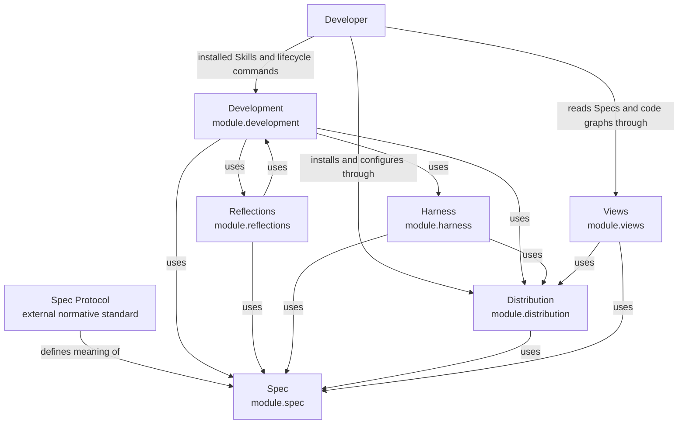

```concorde-document
{
  "id": "document.concorde.module",
  "targets": [
    "module.concorde"
  ],
  "main_visible": true
}
```

# Concorde Framework

Turn specified intent into inspectable changes, and distribute the tools and views needed to work with those changes.

## Contract identity and context

`module.concorde` follows Spec Protocol 2.1.0. It is the project entry Module. The complete contract is the Markdown collection explicitly registered in `.concorde/specs.json`; links and realization references do not expand it. This reading entry introduces the collection and the six contained Modules, each of which owns its own complete collection.

## Architecture

Authored source: `specs/modules/concorde/module.md` (the Mermaid fence in this section). Kind: `mermaid`. Title: **Concorde Framework Modules and their dependencies**. The source is included through this document’s explicit membership; it is not a separate external diagram record.



Six Modules have this Module as their sole structural parent, and the arrows are their registered `uses` relationships. **Spec** owns the project's Spec model: the pinned Protocol binding, the registry, structural validation and initialization. **Harness** owns how an Agent is configured and run: the four context kinds it freezes, Agent and Harness definitions, permissions, native execution and the LangGraph control flow. **Development** owns the business workflows: questions, the development loop, topology evolution, candidate evidence and delivery. **Reflections** retains attributed feedback and gaps and hands approved work back to Development, so the two Modules use each other. **Distribution** builds authored projections, installs them and provisions the managed runtime. **Views** publishes registered Specs and opens an existing code graph.

A developer request carries intent and constraints. Project Specs supply promised behavior; a candidate worktree holds proposed changes and revision-bound evidence. A ready candidate ends development; only a separately authorized delivery updates the destination.

### Project diagram convention

Every Concorde Module MUST describe its principal entities and directed relationships with an inline Mermaid diagram in its `module.md` Architecture section. Labels, titles, descriptions and explanatory prose use English. Include an accessible title and description, and explain the relationships, cardinalities or state rules needed to read the diagram. Diagram nodes are domain concepts unless explicitly identified as Modules. This is a Concorde project convention under the tool-neutral Spec Protocol, not a change to the independent standard. Rendered SVG/HTML and navigation remain derived views.

## Features

### feature.concorde.develop

Given intended behavior and constraints, route a change to its providing Module and coordinate specification, planning, implementation and required evidence in one candidate. Return ready only when the current candidate meets its configured completion conditions. Missing promises stop dependent work; failure preserves inspectable progress. Delivery requires its separately authorized transition.

### feature.concorde.inspect

Given a question or a requested view, expose a Spec-grounded answer through Development, authored Spec pages and declared relationships through Views, or an existing raw code graph through Views. Reading does not mutate project contracts. Missing Spec promises, invalid publication inputs and unavailable graph or runtime inputs are reported by the selected interface.

### feature.concorde.adopt

Given an installation target and supported integration, preview and apply owned installation changes while preserving user content. Initialize only an uninitialized project, pin its accepted Protocol binding and record unspecified business behavior as a draft. Conflicting ownership or failed provisioning prevents successful adoption and triggers recovery of replaced owned state.

## Interfaces

### interface.concorde.use

The developer supplies a task, constraints and optionally a target/focus hint through an installed Skill; deterministic commands accept their documented project and integration options. The host returns a versioned capability result that distinguishes admission failure, execution failure and the domain outcome, or a command-specific exit status. Routing hints never grant file access. Read and preview operations do not mutate project state. Authoring, installation and delivery require their action-specific current preconditions; a failed call may leave an inspectable candidate but cannot claim successful delivery. Repeated reads use current inputs; repeated mutations re-admit saved state or require a fresh proposal, rather than silently replaying stale effects. Unsupported versions and integrations fail explicitly.

### Developer entry selection

| Intent | Entry and completion |
| --- | --- |
| Ask about a Spec or route a task | `concorde-main` takes intent and optional target/focus hints; an answer or attributed limitation completes a query without mutation. |
| Develop a change | `concorde-dev-loop` takes task/constraints and optional authoring/review flags; completion is a ready candidate, with explicit skips where authorized. |
| Initialize a project | `concorde-init` proposes then applies initial configuration and an honest Module stub; an existing project cannot be overwritten. |
| Change integration settings | `concorde-configure` applies an explicit supported integration/enforcement configuration to an initialized project. |
| Check a candidate | `concorde-validate` records current deterministic evidence; a failed or stale check cannot establish readiness. |
| Deliver a candidate | `concorde-deliver` stages the selected change on an independent branch and removes its worktree by default; only a separate explicitly authorized request by the sole primary writer merges it into the primary branch. |
| Work with recorded feedback | `concorde-reflections-triage` selects explicit Module-owned reports/gaps; status is read-only and mutations follow their declared evidence and disposition conditions. |

Installed Skills use a single schema-3 capability invocation with `capability_id`, execute or describe-policy mode, configuration and a version-1 typed request. Unsupported versions, malformed requests and integration mismatch fail admission. The result reports succeeded, blocked, failed or described; domain output still distinguishes a ready candidate, gap, conflict or completed answer. Describe-policy reports the bound grant without launching an Agent. Standard execution can create candidate state and invoke separately bounded Agents; only the admitted action can change files.

Human views are complementary entries: Views presents registered contracts and declared relationships and opens a preexisting raw code graph. A view or feedback comment does not itself authorize code changes, claim Spec/code agreement or create a Reflection. The developer's explicit intent and constraints determine a subsequent task.

## Local collaboration agreements

These entries describe the six children registered for this Module from the Framework's own perspective. Each child's complete contract is its own registered collection; these promises are only what the composition relies on.

```concorde-dependencies
[
  {
    "target_id": "module.spec",
    "responsibility": "Own the project Spec model: Protocol binding, registry, structural validation and initialization.",
    "selection_condition": "When any entry must identify a Module, resolve its documents and file bindings, or initialize a project.",
    "relied_upon_promises": [
      "Every registered identity, membership, implementation reference and file owner resolves deterministically and structural inconsistencies are rejected before any Agent runs.",
      "Initialization creates an honest stub with a pinned Protocol binding and never overwrites an existing project."
    ]
  },
  {
    "target_id": "module.harness",
    "responsibility": "Configure and run every Agent invocation: frozen context kinds, Agent and Harness bindings, effective permissions, native execution and LangGraph control flow.",
    "selection_condition": "When an entry needs an Agent to reason or act.",
    "relied_upon_promises": [
      "An invocation receives only its frozen Spec, implementation, capability and task context and acts only within its compiled permissions; process exit alone is never success.",
      "Every control flow is an inspectable LangGraph graph with bounded loops and typed completions."
    ]
  },
  {
    "target_id": "module.development",
    "responsibility": "Provide the installed Skill boundary and the query, development, topology, validation and delivery workflows.",
    "selection_condition": "When a developer asks a question, develops a change, evolves topology, checks or delivers a candidate.",
    "relied_upon_promises": [
      "A request completes with a typed result that distinguishes a ready candidate, an attributed gap, a conflict or a completed answer, and development ends at ready without delivering.",
      "Delivery changes a destination only under its separately authorized request."
    ]
  },
  {
    "target_id": "module.reflections",
    "responsibility": "Retain, investigate and resolve explicitly attributed feedback and persistent gaps.",
    "selection_condition": "When a developer works with recorded feedback.",
    "relied_upon_promises": [
      "Only explicitly selected records change, ordinary feedback never becomes a Reflection automatically, and human disposition controls resolution."
    ]
  },
  {
    "target_id": "module.distribution",
    "responsibility": "Build authored projections, install and configure owned integrations and provision the managed runtime.",
    "selection_condition": "When a project adopts, updates or configures the Framework, or when built assets must be current.",
    "relied_upon_promises": [
      "Installation and provisioning preserve user-owned content and restore previously valid owned state on failure.",
      "Generated assets are derived from authored sources and a stale build is refused rather than executed."
    ]
  },
  {
    "target_id": "module.views",
    "responsibility": "Publish registered Specs as a navigable site and open an existing raw code graph.",
    "selection_condition": "When a developer wants to read Specs or inspect the code graph.",
    "relied_upon_promises": [
      "Published pages derive from registered sources without creating a second authority, and viewing never mutates project contracts."
    ]
  }
]
```

## Realizations

This composition Module has no directly registered Implementation Spec. Its children realize the delegated capabilities; their file bindings are not inherited by this Module.
