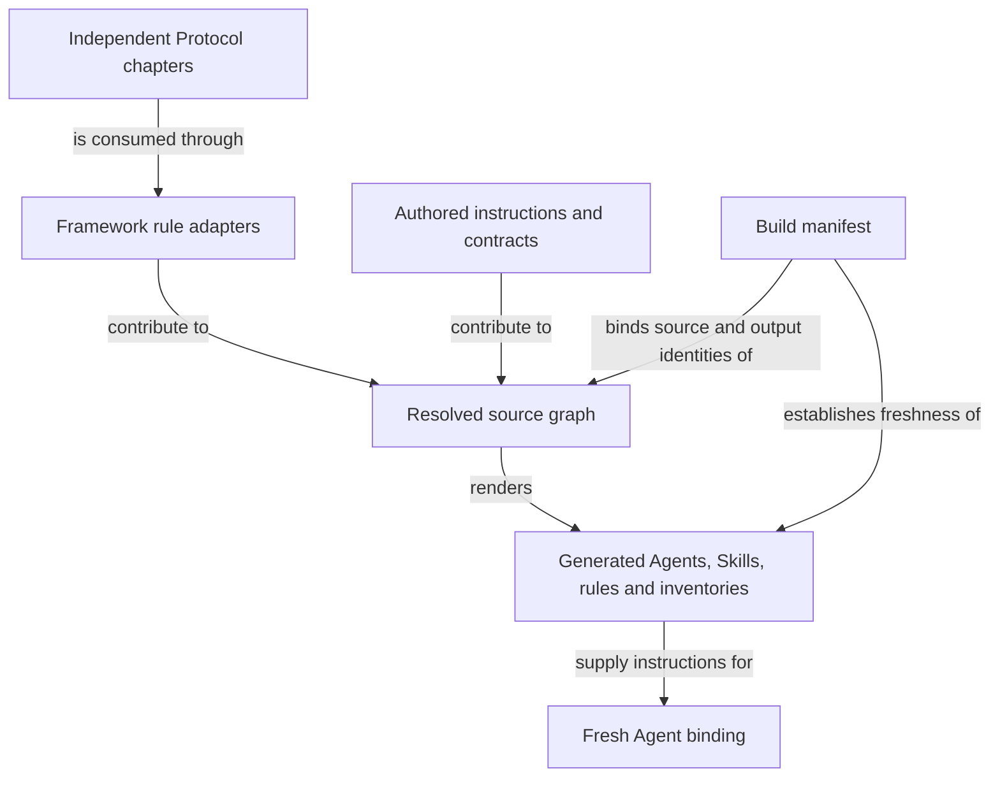

```concorde-document
{
  "id": "document.specs.modules.concorde.package-assets.module",
  "targets": [
    "module.package-assets"
  ],
  "main_visible": true
}
```

# Package assets

Build deterministic Agent, Skill, Protocol, schema and documentation assets from authored sources.

## Contract identity and context

`module.package-assets` follows Spec Protocol 2.0.0. Its sole structural parent is `module.concorde`. The complete contract is the Markdown collection explicitly registered in `.concorde/specs.json`; links and realization references do not expand it. This reading entry introduces the collection.

The registered companion documents explain [interfaces](interfaces.md). Their content remains authoritative regardless of navigation visibility.

## Architecture

Authored source: `specs/modules/concorde/package-assets/module.md` (the Mermaid fence in this section). Kind: `mermaid`. Title: **Package assets entities and relationships**. The source is included through this document’s explicit membership; it is not a separate external diagram record.



Authored Agent responsibilities, Skill instructions, rule adapters and capability contracts form a source graph. Include resolution admits that graph, enforces layering and produces deterministic rendered outputs. A build manifest records source/output identities; generated runtime and documentation assets remain derived views.

The independent Protocol is an external normative input consumed through authored adapters. Rendering does not install consumer state. Writing replaces only this generator's owned outputs; comparison is read-only. Loading an Agent requires a current binding and source identity. Project Mermaid diagrams belong to registered Spec Markdown and are rendered by Publication, outside the instruction build's ownership.

## Features

### feature.package-assets.provide

For authored Framework assets and an integration selection, render deterministic Agent, Skill, rule, schema and documentation outputs; write them only to owned projection locations or compare them without writes. Source digests bind runtime freshness. Invalid includes, bindings, package contracts or stale assets produce findings or BuildError and cannot authorize stale execution.

## Interfaces

### api.assets.render

build renders assets; write_build writes owned projections; check_build compares without changing the worktree. verify_fresh detects changed authoring sources. Module and Implementation kind definitions are distributed together. Generated assets are derived outputs and are never independent authoring sources.

The [local interface contract](interfaces.md) defines accepted inputs, outputs, effects, errors and compatibility. A successful shape check alone does not establish successful execution or a complete business contract.

## Local collaboration agreements

These entries describe the exact direct providers and children registered for this Module. They state relied-upon behavior without importing another Module’s documents.

```concorde-dependencies
[
  {
    "target_id": "module.wire-contracts",
    "responsibility": "Admit versioned structured values, offline schemas and safe project paths.",
    "selection_condition": "When admitting typed values, offline schemas, digests or safe paths.",
    "relied_upon_promises": [
      "TypedValue envelopes identify a type, version and data. Unknown fields, unsupported identities and malformed values fail admission. File-path helpers reject traversal and aliases. Schema validation is deterministic and offline; a validation error never grants a different context or fallback authority."
    ]
  }
]
```

## Realizations

The registered realizations are `implementation.package-build`, `implementation.protocol-assets`. They describe exact file ownership and internal implementation choices separately. Module/Feature/Interface selection includes this full contract collection and does not load those Implementation Specs. Code writing and dedicated code review use their separately declared Framework authority.
