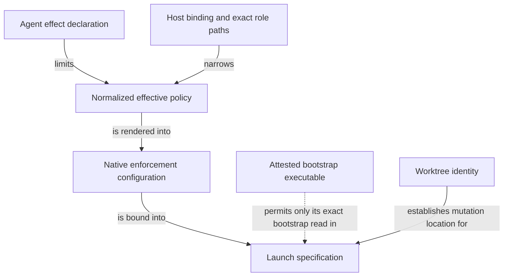

```concorde-document
{
  "id": "document.specs.modules.concorde.permissions.module",
  "targets": [
    "module.permissions"
  ],
  "main_visible": true
}
```

# Execution permissions

Compile declared effects and host authority into reproducible execution permissions.

## Contract identity and context

`module.permissions` follows Spec Protocol 2.0.0. Its sole structural parent is `module.concorde`. The complete contract is the Markdown collection explicitly registered in `.concorde/specs.json`; links and realization references do not expand it. This reading entry introduces the collection.

The registered companion documents explain [interfaces](interfaces.md), [runtime-values](runtime-values.md), [agents-and-harnesses](agents-and-harnesses.md). Their content remains authoritative regardless of navigation visibility.

## Architecture

Authored source: `specs/modules/concorde/permissions/module.md` (the Mermaid fence in this section). Kind: `mermaid`. Title: **Execution permissions entities and relationships**. The source is included through this document’s explicit membership; it is not a separate external diagram record.



An effect declaration is the Agent's maximum authority. A host policy binding narrows it using concrete role-path sets and explicit exclusions. The normalized policy records reproducible effective reads, writes, commands, network and credential boundaries; native configuration translates those limits for the chosen integration.

Compilation is pure and cannot select Agents, resolve their contexts or grant delegation. The trusted caller admits those operations before requesting a policy. Native rendering must enforce the resulting boundary or refuse it; a host-attested executable bootstrap is a narrowly identified exception. Worktree inspection establishes location identity, while an isolation check applies the caller's explicit mutation requirement.

## Features

### feature.permissions.provide

For declared Agent effects, explicit role paths and a narrowing host binding, produce a reproducible effective policy and native launch configuration. Enforce that grants cannot exceed either the declaration or caller authority. Unknown roles, unsafe paths, widened authority or unsupported enforcement reject compilation or rendering before task execution.

## Interfaces

### api.permissions.compile

compile_policy intersects role paths and caller authority. Native renderers establish the resulting read, write, command and network boundaries or reject unsupported enforcement. Only a code-writing invocation may write its bound implementation files and admitted Implementation Spec documents; Module contracts remain immutable in that phase.

The [local interface contract](interfaces.md) defines accepted inputs, outputs, effects, errors and compatibility. A successful shape check alone does not establish successful execution or a complete business contract.

## Local collaboration agreements

These entries describe the exact direct providers and children registered for this Module. They state relied-upon behavior without importing another Module’s documents.

```concorde-dependencies
[
  {
    "target_id": "module.wire-contracts",
    "responsibility": "Admit versioned structured values, offline schemas and safe project paths.",
    "selection_condition": "When admitting typed values, offline schemas, digests or safe paths.",
    "relied_upon_promises": [
      "TypedValue envelopes identify a type, version and data. Unknown fields, unsupported identities and malformed values fail admission. File-path helpers reject traversal and aliases. Schema validation is deterministic and offline; a validation error never grants a different context or fallback authority."
    ]
  }
]
```

## Realizations

The registered realizations are `implementation.permissions`, `implementation.worktree-lifecycle`. They describe exact file ownership and internal implementation choices separately. Module/Feature/Interface selection includes this full contract collection and does not load those Implementation Specs. Code writing and dedicated code review use their separately declared Framework authority.
