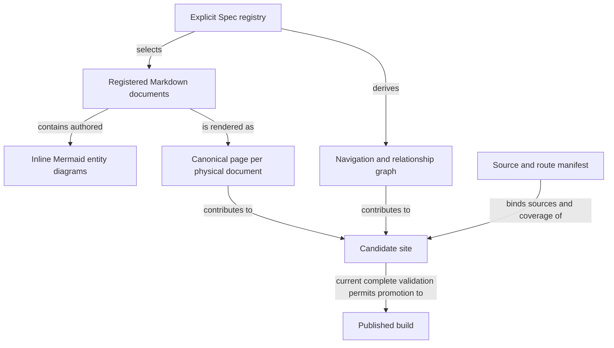

```concorde-document
{
  "id": "document.specs.modules.concorde.publication.module",
  "targets": [
    "module.publication"
  ],
  "main_visible": true
}
```

# Spec publication

Create navigable documentation and diagrams from registered Module and Implementation Specs.

## Contract identity and context

`module.publication` follows Spec Protocol 2.0.0. Its sole structural parent is `module.concorde`. The complete contract is the Markdown collection explicitly registered in `.concorde/specs.json`; links and realization references do not expand it. This reading entry introduces the collection.

The registered companion documents explain [interfaces](interfaces.md), [pipeline](pipeline.md). Their content remains authoritative regardless of navigation visibility.

## Architecture

Authored source: `specs/modules/concorde/publication/module.md` (the Mermaid fence in this section). Kind: `mermaid`. Title: **Spec publication entities and relationships**. The source is included through this document’s explicit membership; it is not a separate external diagram record.



An explicit registry supplies Module/Implementation memberships and relationships. Each physical Markdown document becomes one canonical page carrying its identity, all memberships and source digest. Inline Mermaid fences describe the owning contract's entities and relationships; they are authored document content, not a second architecture authority.

Materialization derives pages, path-based navigation, target navigation and graph edges. A candidate manifest binds those views to exact source bytes and route coverage. The build promotes a complete current candidate while preserving the previous successful output on failure. Scaffold proposals have their own exact-file transaction; rendering project Specs does not authorize editing them.

## Features

### feature.publication.publish

For an explicitly registered project, create or update an accepted documentation scaffold and derive one canonical page per physical Spec, navigation and relationship views. Render Mermaid source inside its owning Markdown page. Promote only a complete candidate tied to current source bytes; invalid links, diagrams or stale build inputs preserve the previous published build.

## Interfaces

### api.publication.build

concorde docsite proposes and applies site scaffolding. The site reads registry schema 2 and builds pages, navigation and relationship views from registered sources. Module composition, dependencies and implementation reuse are distinct edges. Each Module opens its module.md. Implementation pages expose their file bindings and using Modules. Only a complete current candidate is promoted.

The [local interface contract](interfaces.md) defines accepted inputs, outputs, effects, errors and compatibility. A successful shape check alone does not establish successful execution or a complete business contract.

## Local collaboration agreements

These entries describe the exact direct providers and children registered for this Module. They state relied-upon behavior without importing another Module’s documents.

```concorde-dependencies
[
  {
    "target_id": "module.file-transactions",
    "responsibility": "Apply exact multi-file changes with before-digest checks and rollback.",
    "selection_condition": "When applying exact proposed file replacements with current preconditions.",
    "relied_upon_promises": [
      "file_change captures a current before-digest. apply_files accepts exact allowed paths, stages changes, rechecks originals and invokes verification. Invalid or stale preflight causes no replacement. A later failure restores changed original bytes and removes transaction-created files when recovery I/O succeeds; recovery failure remains explicit. Proposed content cannot expand the allowed set."
    ]
  }
]
```

## Realizations

The registered realizations are `implementation.publication-scaffold`, `implementation.publication-docsite`. They describe exact file ownership and internal implementation choices separately. Module/Feature/Interface selection includes this full contract collection and does not load those Implementation Specs. Code writing and dedicated code review use their separately declared Framework authority.
