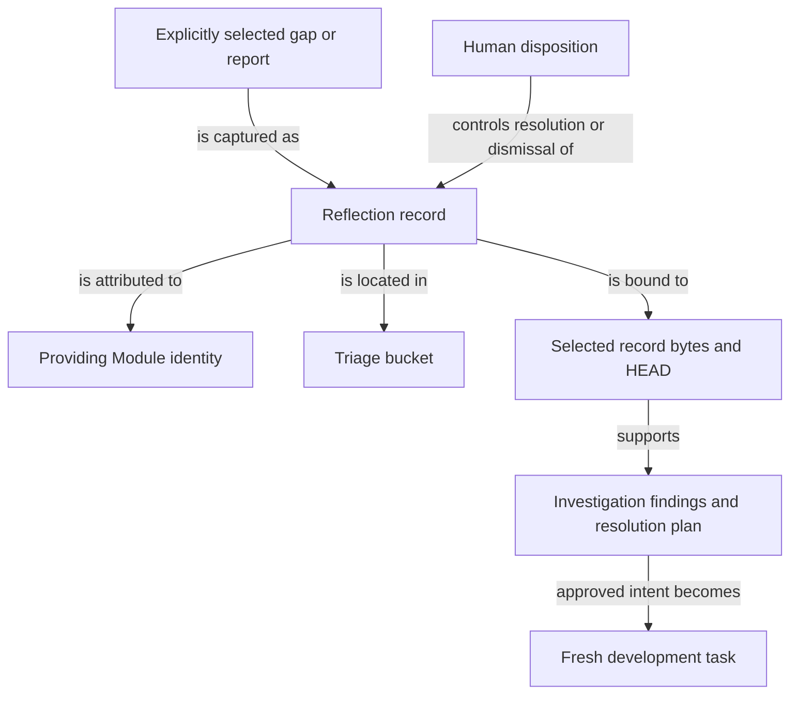

```concorde-document
{
  "id": "document.specs.modules.concorde.reflections.module",
  "targets": [
    "module.reflections"
  ],
  "main_visible": true
}
```

# Reflections

Retain, investigate and resolve explicitly attributed project feedback and persistent gaps.

## Contract identity and context

`module.reflections` follows Spec Protocol 2.0.0. Its sole structural parent is `module.concorde`. The complete contract is the Markdown collection explicitly registered in `.concorde/specs.json`; links and realization references do not expand it. This reading entry introduces the collection.

The registered companion documents explain [interfaces](interfaces.md), [lifecycle](lifecycle.md). Their content remains authoritative regardless of navigation visibility.

## Architecture

Authored source: `specs/modules/concorde/reflections/module.md` (the Mermaid fence in this section). Kind: `mermaid`. Title: **Reflections entities and relationships**. The source is included through this document’s explicit membership; it is not a separate external diagram record.



A Reflection retains a report, original comments, stable identity and Module attribution. Its status describes human disposition; its directory bucket independently describes triage progress. A monotonic allocator prevents identity reuse. An explicitly captured gap links the report to existing change history without resolving that gap.

Investigation binds selected record bytes and HEAD, produces findings and an evidence-bound plan, and preserves the report. Approved intended behavior can become a fresh development task. Implementation completion does not itself supply human disposition; closing or removing a record follows the separately defined resolution/merge evidence. Stale inputs keep the report available for a later valid attempt.

## Features

### feature.reflections.triage

For explicit Module-owned report or gap IDs, expose read-only status or perform the requested capture, investigation, approved implementation or human disposition transition. Preserve the original observation and comments and bind investigations to selected records and HEAD. Foreign IDs, stale evidence or missing required approval stop the affected transition; ordinary feedback is not automatically recorded.

## Interfaces

### interface.reflections.use

The triage boundary selects explicit records by Module or local feature/interface identity. Status is read-only. Investigation runs in a separately bound code invocation. Verified findings and developer disposition determine further work; ordinary feedback does not automatically create a Reflection or enlarge its owner.

The [local interface contract](interfaces.md) defines accepted inputs, outputs, effects, errors and compatibility. A successful shape check alone does not establish successful execution or a complete business contract.

## Local collaboration agreements

These entries describe the exact direct providers and children registered for this Module. They state relied-upon behavior without importing another Module’s documents.

```concorde-dependencies
[
  {
    "target_id": "module.workflows",
    "responsibility": "Route tasks and coordinate specification, planning, coding, review, topology changes and delivery.",
    "selection_condition": "When turning approved intended behavior into a separately bound development or investigation invocation.",
    "relied_upon_promises": [
      "The public boundary is a versioned TypedValue invocation of an installed concorde-* Skill. Global calls select the owning Module; lifecycle calls perform declared deterministic actions. A planner determines tasks from the selected Module Spec alone. Code writers additionally receive referenced Implementation Specs. Each stage reports its own completion and gaps; a completed component does not independently deliver the enclosing change."
    ]
  },
  {
    "target_id": "module.spec-context",
    "responsibility": "Resolve complete Module contracts, bind code-writing implementation context and validate explicit Spec structure.",
    "selection_condition": "When resolving a complete Module context or preparing initial project Spec state.",
    "relied_upon_promises": [
      "resolve_context selects one Module and its complete registered documents. Feature focus never trims the collection. Non-code phases do not receive Implementation Specs or source. The implementation phase adds only the referenced Implementation Specs and exact bound files. Membership, bytes, rules and admitted stage inputs determine context identity."
    ]
  },
  {
    "target_id": "module.registry",
    "responsibility": "Admit Module and Implementation identities, resolve document collections and look up exact file ownership and reuse.",
    "selection_condition": "When resolving identities, document membership or exact implementation users.",
    "relied_upon_promises": [
      "SpecRepository reads registry schema 2. select returns a Module descriptor. Implementation records form a separate index, file_implementations maps each declared file to one owner, and implementation_users maps each Implementation Spec to all using Modules. Lookups never follow a relationship to read another Spec body."
    ]
  }
]
```

## Realizations

The registered realizations are `implementation.reflections`. They describe exact file ownership and internal implementation choices separately. Module/Feature/Interface selection includes this full contract collection and does not load those Implementation Specs. Code writing and dedicated code review use their separately declared Framework authority.
