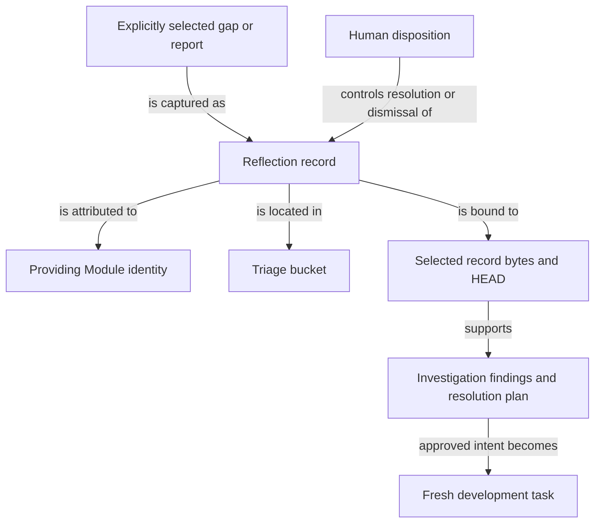

```concorde-document
{
  "id": "document.reflections.module",
  "targets": [
    "module.reflections"
  ],
  "main_visible": true
}
```

# Reflections

Retain, investigate and resolve explicitly attributed project feedback and persistent gaps.

## Contract identity and context

`module.reflections` follows Spec Protocol 2.1.0. Its sole structural parent is `module.concorde`. The complete contract is the Markdown collection explicitly registered in `.concorde/specs.json`; links and realization references do not expand it. This reading entry introduces the collection.

The registered companion documents explain [interfaces](interfaces.md) and [lifecycle](lifecycle.md). Their content remains authoritative regardless of navigation visibility.

## Architecture

Authored source: `specs/modules/concorde/reflections/module.md` (the Mermaid fence in this section). Kind: `mermaid`. Title: **Reflections entities and relationships**. The source is included through this document’s explicit membership; it is not a separate external diagram record.



A Reflection retains a report, original comments, stable identity and Module attribution. Its status describes human disposition; its directory bucket independently describes triage progress. A monotonic allocator prevents identity reuse. An explicitly captured gap links the report to existing change history without resolving that gap.

Investigation binds selected record bytes and HEAD, produces findings and an evidence-bound plan, and preserves the report. Approved intended behavior can become a fresh development task. Implementation completion does not itself supply human disposition; closing or removing a record follows the separately defined resolution/merge evidence. Stale inputs keep the report available for a later valid attempt.

## Features

### feature.reflections.triage

For explicit Module-owned report or gap IDs, expose read-only status or perform the requested capture, investigation, approved implementation or human disposition transition. Preserve the original observation and comments and bind investigations to selected records and HEAD. Foreign IDs, stale evidence or missing required approval stop the affected transition; ordinary feedback is not automatically recorded.

## Interfaces

### interface.reflections.use

The triage boundary selects explicit records by Module or local feature/interface identity. Status is read-only. Investigation runs in a separately bound code invocation. Verified findings and developer disposition determine further work; ordinary feedback does not automatically create a Reflection or enlarge its owner.

The [local interface contract](interfaces.md) defines accepted inputs, outputs, effects, errors and compatibility. A successful shape check alone does not establish successful execution or a complete business contract.

## Local collaboration agreements

These entries describe the exact direct providers registered for this Module. Development and this Module use each other: Development records gaps here, and approved work here runs through Development.

```concorde-dependencies
[
  {
    "target_id": "module.development",
    "responsibility": "Run investigation and approved implementation as separately bound invocations and development loops.",
    "selection_condition": "When turning approved intended behavior into a development or investigation invocation.",
    "relied_upon_promises": [
      "An investigation or development invocation is fresh, bound to one Module and its recorded task, and reports its own completion, gaps and evidence without delivering."
    ]
  },
  {
    "target_id": "module.spec",
    "responsibility": "Resolve Module, feature and interface identities for attribution.",
    "selection_condition": "When admitting a record's owner or a selected local identity.",
    "relied_upon_promises": [
      "A registered identity resolves to exactly one providing Module, and an unknown or foreign identity is rejected."
    ]
  }
]
```

## Realizations

The registered realizations are `implementation.reflections`, `implementation.file-transactions` and `implementation.legacy-understanding`. They describe exact file ownership and internal implementation choices separately; the legacy realization is a pending removal that this Module still imports for path helpers. Module/Feature/Interface selection includes this full contract collection and does not load those Implementation Specs.
