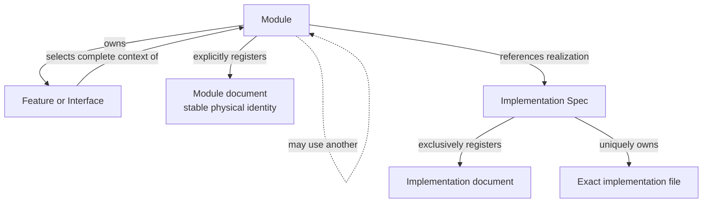

```concorde-document
{
  "id": "document.specs.modules.concorde.registry.module",
  "targets": [
    "module.registry"
  ],
  "main_visible": true
}
```

# Spec registry

Admit Module and Implementation identities, resolve document collections and look up exact file ownership and reuse.

## Contract identity and context

`module.registry` follows Spec Protocol 2.0.0. Its sole structural parent is `module.concorde`. The complete contract is the Markdown collection explicitly registered in `.concorde/specs.json`; links and realization references do not expand it. This reading entry introduces the collection.

The registered companion documents explain [interfaces](interfaces.md), [values](values.md). Their content remains authoritative regardless of navigation visibility.

## Architecture

Authored source: `specs/modules/concorde/registry/module.md` (the Mermaid fence in this section). Kind: `mermaid`. Title: **Spec registry entities and relationships**. The source is included through this document’s explicit membership; it is not a separate external diagram record.



The registry separates semantic identities, physical document identities and implementation-file ownership. A Module registers documents and owns local features/interfaces; a document may belong to multiple Modules only by explicit membership. Parent edges form a forest, uses edges express capability dependencies, and realization references connect Modules to reusable Implementation Specs.

Admission creates immutable selection records and reverse indexes from exact declarations. Overlay bytes support candidate inspection without writes. Selection never walks dependencies to read bodies. Every file has one Implementation owner even when several Modules reference that realization; a changed path can therefore identify all affected consumers without granting access to their contracts.

## Features

### feature.registry.provide

For a configured project or an explicit in-memory candidate, admit identities and memberships and return complete Module descriptors, local documents, declared contracts and exact implementation ownership/reuse indexes. Reject unresolved references, composition cycles, duplicate owners and malformed metadata. Read-only lookup never infers membership from a directory, link or dependency. Stable-ID file-set queries also resolve Features, Interfaces and Implementation Specs; an explicit Module/Implementation pair remains separate from ordinary Module context.

## Interfaces

### api.registry.select

SpecRepository reads registry schema 2. select returns a Module descriptor. Implementation records form a separate index, file_implementations maps each declared file to one owner, and implementation_users maps each Implementation Spec to all using Modules. Lookups never follow a relationship to read another Spec body.

The [local interface contract](interfaces.md) defines accepted inputs, outputs, effects, errors and compatibility. A successful shape check alone does not establish successful execution or a complete business contract.

## Local collaboration agreements

These entries describe the exact direct providers and children registered for this Module. They state relied-upon behavior without importing another Module’s documents.

```concorde-dependencies
[
  {
    "target_id": "module.wire-contracts",
    "responsibility": "Admit versioned structured values, offline schemas and safe project paths.",
    "selection_condition": "When admitting typed values, offline schemas, digests or safe paths.",
    "relied_upon_promises": [
      "TypedValue envelopes identify a type, version and data. Unknown fields, unsupported identities and malformed values fail admission. File-path helpers reject traversal and aliases. Schema validation is deterministic and offline; a validation error never grants a different context or fallback authority."
    ]
  }
]
```

## Realizations

The registered realizations are `implementation.registry`. They describe exact file ownership and internal implementation choices separately. Module/Feature/Interface selection includes this full contract collection and does not load those Implementation Specs. Code writing and dedicated code review use their separately declared Framework authority.
