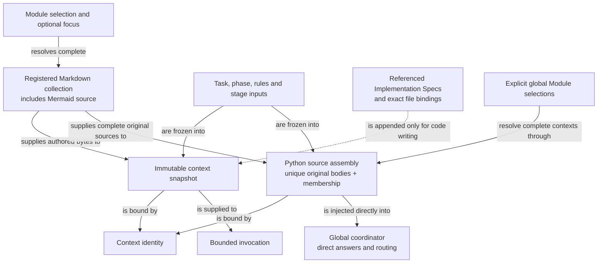

```concorde-document
{
  "id": "document.specs.modules.concorde.spec-context.module",
  "targets": [
    "module.spec-context"
  ],
  "main_visible": true
}
```

# Module contexts

Resolve complete Module contracts, bind code-writing implementation context and validate explicit Spec structure.

## Contract identity and context

`module.spec-context` follows Spec Protocol 2.0.0. Its sole structural parent is `module.concorde`. The complete contract is the Markdown collection explicitly registered in `.concorde/specs.json`; links and realization references do not expand it. This reading entry introduces the collection.

The registered companion documents explain [interfaces](interfaces.md), [runtime-values](runtime-values.md), [values](values.md), [agents-and-harnesses](agents-and-harnesses.md). Their content remains authoritative regardless of navigation visibility.

## Architecture

Authored source: `specs/modules/concorde/spec-context/module.md` (the Mermaid fence in this section). Kind: `mermaid`. Title: **Module contexts entities and relationships**. The source is included through this document’s explicit membership; it is not a separate external diagram record.



A selection identifies one providing Module and an optional local focus. Its registered collection supplies the complete project contract. Context assembly combines those authored bytes with the phase, task, pinned rules, instructions and admitted stage inputs; the resulting immutable snapshot is identified by all admitted bytes and lifecycle identity.

Implementation references identify a separate realization view. Only a code-writing phase appends its Implementation Spec bodies; code review receives its separately declared file read grant. Neither focus nor an inline diagram narrows or expands membership. Initialization and topology authoring propose complete sources; the transaction boundary applies only current, admitted replacements. Global context assembly deterministically combines explicitly selected complete Module contexts, deduplicates source bodies and preserves membership for direct coordinator reasoning.

## Features

### feature.concorde.define-project-ontology

For an explicit Module/Implementation inventory, admit stable identities, exact document membership, single-parent composition, directed uses and unique file ownership as one model. Report missing local dependency promises as affected-Module gaps and contradictory declarations as conflicts. Registry shape alone does not prove semantic completeness.

### feature.context.resolve

For one Module ID, phase, task and optional local Feature/Interface focus, freeze its complete registered Markdown and declared architecture sources with the accepted rules and admitted stage inputs. Global assembly supports several explicit Module selections and injects complete deduplicated source pools directly into the coordinator. Focus changes the question, not membership. Code writing additionally receives referenced Implementation Specs and exact file bindings; invalid input or stale binding yields no reusable partial snapshot.

### feature.context.initialize

For an uninitialized project, propose configuration, a schema-2 registry and an honest Module stub with an inline Mermaid entity diagram. Apply only an accepted proposal whose destinations remain absent and whose Protocol binding is current. An existing project, changed precondition or invalid final structure prevents application; unresolved business facts remain explicit in the stub.

## Interfaces

### interface.spec-context.use

resolve_context selects one Module and its complete registered documents. Feature focus never trims the collection. Non-code phases do not receive Implementation Specs or source. The implementation phase adds only the referenced Implementation Specs and exact bound files. resolve_discovery_context resolves several explicit Module selections with source pools and per-Module references for questions, routing and topology design. Membership, bytes, rules and admitted stage inputs determine context identity.

The [local interface contract](interfaces.md) defines accepted inputs, outputs, effects, errors and compatibility. A successful shape check alone does not establish successful execution or a complete business contract.

## Local collaboration agreements

These entries describe the exact direct providers and children registered for this Module. They state relied-upon behavior without importing another Module’s documents.

```concorde-dependencies
[
  {
    "target_id": "module.registry",
    "responsibility": "Admit Module and Implementation identities, resolve document collections and look up exact file ownership and reuse.",
    "selection_condition": "When resolving identities, document membership or exact implementation users.",
    "relied_upon_promises": [
      "SpecRepository reads registry schema 2. select returns a Module descriptor. Implementation records form a separate index, file_implementations maps each declared file to one owner, and implementation_users maps each Implementation Spec to all using Modules. Lookups never follow a relationship to read another Spec body."
    ]
  },
  {
    "target_id": "module.wire-contracts",
    "responsibility": "Admit versioned structured values, offline schemas and safe project paths.",
    "selection_condition": "When admitting typed values, offline schemas, digests or safe paths.",
    "relied_upon_promises": [
      "TypedValue envelopes identify a type, version and data. Unknown fields, unsupported identities and malformed values fail admission. File-path helpers reject traversal and aliases. Schema validation is deterministic and offline; a validation error never grants a different context or fallback authority."
    ]
  },
  {
    "target_id": "module.file-transactions",
    "responsibility": "Apply exact multi-file changes with before-digest checks and rollback.",
    "selection_condition": "When applying exact proposed file replacements with current preconditions.",
    "relied_upon_promises": [
      "file_change captures a current before-digest. apply_files accepts exact allowed paths, stages changes, rechecks originals and invokes verification. Invalid or stale preflight causes no replacement. A later failure restores changed original bytes and removes transaction-created files when recovery I/O succeeds; recovery failure remains explicit. Proposed content cannot expand the allowed set."
    ]
  },
  {
    "target_id": "module.package-assets",
    "responsibility": "Build deterministic Agent, Skill, Protocol, schema and documentation assets from authored sources.",
    "selection_condition": "When loading current generated instructions and their source-bound Agent definitions.",
    "relied_upon_promises": [
      "For authored Framework assets and an integration selection, render deterministic Agent, Skill, rule, schema and documentation outputs; write them only to owned projection locations or compare them without writes. Source digests bind runtime freshness. Invalid includes, bindings, package contracts or stale assets produce findings or BuildError and cannot authorize stale execution."
    ]
  }
]
```

## Realizations

The registered realizations are `implementation.spec-engine`, `implementation.agent-definitions`. They describe exact file ownership and internal implementation choices separately. Module/Feature/Interface selection includes this full contract collection and does not load those Implementation Specs. Code writing and dedicated code review use their separately declared Framework authority.
