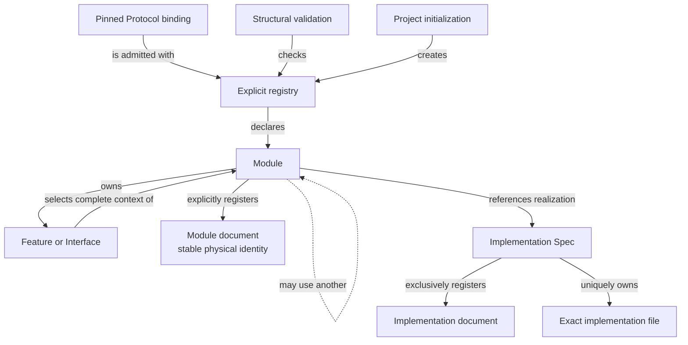

```concorde-document
{
  "id": "document.spec.module",
  "targets": [
    "module.spec"
  ],
  "main_visible": true
}
```

# Spec

Own the project Spec model: the pinned Protocol binding, the explicit registry, structural validation, stable-ID file-set queries and honest initialization.

## Contract identity and context

`module.spec` follows Spec Protocol 2.1.0. Its sole structural parent is `module.concorde`. The complete contract is the Markdown collection explicitly registered in `.concorde/specs.json`; links and realization references do not expand it. This reading entry introduces the collection.

The registered companion documents explain [registry](registry.md), [values](values.md), [structure](structure.md) and [initialize](initialize.md). Their content remains authoritative regardless of navigation visibility.

## Architecture

Authored source: `specs/modules/concorde/spec/module.md` (the Mermaid fence in this section). Kind: `mermaid`. Title: **Spec entities and relationships**. The source is included through this document’s explicit membership; it is not a separate external diagram record.



The registry separates semantic identities, physical document identities and implementation-file ownership. Admission creates immutable selection records and reverse indexes from exact declarations; overlay bytes support candidate inspection without writes. Selection never walks dependencies to read bodies. Every file has one Implementation owner even when several Modules reference that realization, so a changed path identifies all affected consumers without granting access to their contracts. The Module's Spec context and its implementation context are both derived from these declarations and never from directories, links or prose.

Validation establishes structural invariants only: identities, memberships, dependency declarations, focus definitions, structured contracts, file bindings and Reflection attribution. It cannot prove semantic completeness. Initialization proposes and applies a complete starting structure for an uninitialized project and refuses to touch an existing one.

## Features

### feature.spec.ontology

For an explicit Module/Implementation inventory, admit stable identities, exact document membership, single-parent composition, directed uses and unique file ownership as one model. Report missing local dependency promises as affected-Module gaps and contradictory declarations as conflicts. Registry shape alone does not prove semantic completeness.

### feature.spec.registry

For a configured project or an explicit in-memory candidate, admit identities and memberships and return complete Module descriptors, local documents, declared contracts and exact implementation ownership/reuse indexes. Reject unresolved references, composition cycles, duplicate owners, unknown Implementation references and malformed metadata. Read-only lookup never infers membership from a directory, link or dependency. Stable-ID file-set queries also resolve Features, Interfaces and Implementation Specs; an explicit Module/Implementation pair remains separate from ordinary Module context.

### feature.spec.initialize

For an uninitialized project, propose configuration, a schema-2 registry and an honest Module stub with an inline Mermaid entity diagram. Apply only an accepted proposal whose destinations remain absent and whose Protocol binding is current. An existing project, changed precondition or invalid final structure prevents application; unresolved business facts remain explicit in the stub.

## Interfaces

### interface.spec.select

`SpecRepository` reads registry schema 2 under a Profile 9 configuration with a current Protocol binding. `select` returns a complete Module descriptor and rejects a foreign focus. Implementation records form a separate index, `file_implementations` maps each declared file to one owner and `implementation_users` maps each Implementation Spec to all using Modules. Lookups never follow a relationship to read another Spec body and never write project files. The [registry](registry.md) and [values](values.md) documents define the signatures, records and errors.

### interface.spec.validate

`validate_repository` returns success or invalid with rule-identified findings and a source digest for the assessed state. It checks structure and references, not semantics, and configured implementation checks run separately on the host. The [structure](structure.md) document defines the rules and evidence records.

### interface.spec.initialize

`concorde-init` proposes then applies an explicit typed project proposal that creates the configuration, registry, Module stub and Reflection defaults. Application requires every proposed destination to be absent and the Protocol binding to be current, and it restores original bytes on failure. The [initialize](initialize.md) document defines the request, proposal and errors.

### interface.spec.files

`spec_files(entity_id)` returns the complete registered file set of a Module, Feature, Interface or Implementation Spec by explicit identity, and `spec_pair(module_id, implementation_id)` returns one Module's collection with one of its referenced realizations. Both are read-only locator queries defined in [registry](registry.md). Their implementation is a specified addition not yet supplied by code.

## Boundary

This Module has no registered child and no direct software-Module dependency. The independent Spec Protocol is an external normative input, and the typed-value, path and file-transaction helpers it uses are Implementation Specs it references rather than Modules.

## Realizations

The registered realizations are `implementation.spec-model`, `implementation.protocol-assets`, `implementation.typed-values` and `implementation.file-transactions`. They describe exact file ownership and internal implementation choices separately. Module/Feature/Interface selection includes this full contract collection and does not load those Implementation Specs. Code writing and dedicated code review use their separately declared Framework authority.
