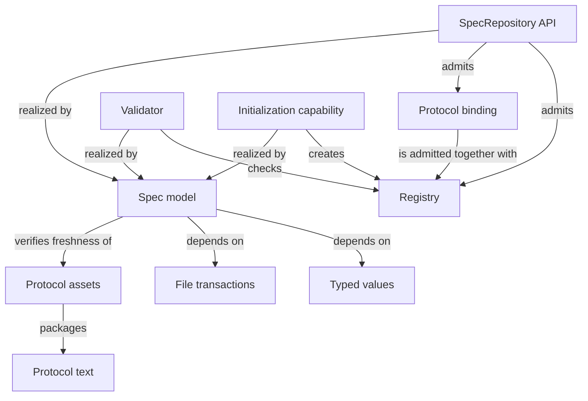

```concorde-document
{
  "id": "document.spec.module",
  "targets": [
    "module.spec"
  ],
  "main_visible": true
}
```

# Spec

## Purpose

Spec owns the project Spec model: the pinned Protocol binding, the explicit registry, deterministic structural validation, stable-ID Spec-context queries and honest project initialization. Its sole structural parent is `module.concorde`, and it has no child Module and no direct Module dependency of its own; every other Module relies on it to resolve identities, documents, entity file bindings and dependency promises without reading a collaborator's implementation. The independent Spec Protocol is an external normative input that this Module admits and pins rather than authors.

## Scenarios

The registered companion documents [registry](registry.md), [values](values.md), [structure](structure.md) and [initialize](initialize.md) define most scenarios; this section introduces the Module's core admission behavior.

### scenario.spec.admit-inventory — Admitting a consistent Module inventory

- GIVEN an explicit registry with Module identities, one structural parent per Module, directed uses, entity file listings and document membership
- AND a Protocol binding that matches the installed Protocol assets
- WHEN the repository is constructed
- THEN it admits immutable Module descriptors, file-ownership and reverse-user indexes
- AND it never reads a listed file's contents or a collaborator's Spec body to do so

### scenario.spec.reject-inconsistent-inventory — Rejecting a structurally inconsistent inventory

- GIVEN a registry with an unresolved parent or use, a composition cycle, a duplicate file owner within one Module, a non-sibling shared provider, or a listed file that is a control, generated or Spec document path
- WHEN the repository is constructed
- THEN admission fails before any Agent runs
- AND no partial repository is returned

### scenario.spec.shared-file — A file shared by several Modules

- GIVEN two Modules each declare an entity that lists the same implementation file
- WHEN the repository is admitted
- THEN both Modules keep that file in their own entity file listing
- AND the reverse index reports every Module that lists the file, so a change to it can be assessed against each of their contracts
- BUT within one Module the file belongs to exactly one of its entities

## Requirements

- req.spec.no-body-read: Resolving a Module's identity, membership or file listing SHALL NOT read a collaborator Module's Spec body or a listed file's contents.
- req.spec.one-owner-per-module: Within one Module, a listed implementation file SHALL belong to exactly one entity.
- req.spec.sibling-sharing: A Module used by more than one consumer SHALL share the same structural parent as its consumers.
- req.spec.no-structural-proof: Structural validation SHALL NOT be represented as proof of semantic completeness.

## Entities

```concorde-entities
[
  {
    "id": "entity.spec.registry",
    "title": "Registry",
    "kind": "concept",
    "responsibility": "The explicit schema-3 JSON inventory of Module identities, document membership, parent/uses relationships, entity file listings and checks that the repository admits."
  },
  {
    "id": "entity.spec.protocol-binding",
    "title": "Protocol binding",
    "kind": "concept",
    "responsibility": "The pinned accepted Protocol version and exact manifest digest recorded in .concorde/config.json and cross-checked against installed Protocol assets before any Spec is admitted."
  },
  {
    "id": "entity.spec.repository-api",
    "title": "SpecRepository API",
    "kind": "interface",
    "responsibility": "The Python query surface (select, documents, contracts, dependencies, spec_files) other Framework code uses to read admitted Spec structure without writing files."
  },
  {
    "id": "entity.spec.validator",
    "title": "Validator",
    "kind": "interface",
    "responsibility": "The validate_repository entry point that checks structure and references and reports findings and a source digest, without proving semantics."
  },
  {
    "id": "entity.spec.init-capability",
    "title": "Initialization capability",
    "kind": "interface",
    "responsibility": "The concorde-init capability and installed Skill that proposes, then applies, an uninitialized project's configuration, registry and honest Module stub."
  },
  {
    "id": "entity.spec.spec-model",
    "title": "Spec model",
    "kind": "program",
    "responsibility": "Realizes registry admission, selection and reverse indexes, deterministic structural validation, project initialization, the concorde-init capability and the package entry points.",
    "files": [
      "capabilities/init.py",
      "skills/concorde-init/SKILL.md",
      "src/concorde/__init__.py",
      "src/concorde/__main__.py",
      "src/concorde/diagnostics.py",
      "src/concorde/model.py",
      "src/concorde/specification/__init__.py",
      "src/concorde/specification/initialize.py",
      "src/concorde/specification/repository.py",
      "src/concorde/specification/validation.py",
      "tests/__init__.py",
      "tests/concorde/__init__.py",
      "tests/concorde/specification/__init__.py",
      "tests/concorde/specification/support.py",
      "tests/concorde/specification/test_distribution.py",
      "tests/concorde/specification/test_module_architecture.py",
      "tests/concorde/specification/test_module_model.py",
      "tests/concorde/support/__init__.py",
      "tests/concorde/support/paths.py"
    ]
  },
  {
    "id": "entity.spec.typed-values",
    "title": "Typed values",
    "kind": "shared program",
    "responsibility": "Realizes versioned value schemas, canonical encoding, safe project paths, the offline interface-schema evaluator and the constrained front-matter parser that every boundary of the Framework uses.",
    "files": [
      "src/concorde/frontmatter.py",
      "src/concorde/host/contract_shapes.py",
      "src/concorde/host/contracts.py",
      "src/concorde/host/typed_data.py",
      "src/concorde/host/wire_shapes.py",
      "src/concorde/specification/schema.py",
      "tests/concorde/host/unit/test_typed_data.py"
    ]
  },
  {
    "id": "entity.spec.file-transactions",
    "title": "File transactions",
    "kind": "shared program",
    "responsibility": "Realizes exact replacement proposals as staged filesystem operations with before-digest checks and original-byte recovery, for every Module that applies an accepted proposal.",
    "files": [
      "src/concorde/specification/changes.py"
    ]
  },
  {
    "id": "entity.spec.protocol-text",
    "title": "Protocol text",
    "kind": "authored standard",
    "responsibility": "Authors the independent Spec Protocol 3.0.0 chapters and templates: principles, Module specifications, Spec management, Spec and Context, Required format, and the Module and Scenario templates.",
    "files": [
      "protocol/README.md",
      "protocol/format.md",
      "protocol/module.md",
      "protocol/principles.md",
      "protocol/spec-management.md",
      "protocol/spec-management/spec-and-context.md",
      "protocol/templates/module.md",
      "protocol/templates/scenario.md"
    ]
  },
  {
    "id": "entity.spec.protocol-assets",
    "title": "Protocol assets",
    "kind": "program",
    "responsibility": "Adapts the independent Protocol text and the Framework execution profile into packaged prompt assets, and pins the exported rule version and generated asset digests in the manifest.",
    "files": [
      "prompts/protocol/framework-profile.md",
      "prompts/protocol/kinds/module.md",
      "prompts/protocol/principles.md",
      "protocol/manifest.json"
    ]
  }
]
```

## Architecture

The registry separates semantic Module identities from implementation-file ownership: Modules register documents and entities, entities bind exact files, and a file may be listed by several Modules while belonging to one entity within each. Admission creates immutable selection records and reverse indexes from exact declarations; overlay bytes support candidate inspection without writes. Selection never walks a dependency to read another Module's body. The Spec model's own package entry points, the Validator and the Initialization capability are three ways of using the same admitted Registry and Protocol binding; the Protocol assets entity packages the authored Protocol text for runtime distribution without becoming a second authority over its meaning.



## Unresolved information

`spec_files(entity_id)` is specified in [registry](registry.md) to resolve a Module or scenario identity to its complete file set, but not yet implemented; the retired `spec_pair` query (Module paired with an Implementation Spec) has no replacement now that Implementation Specs no longer exist. `initialize.py` still writes an external JSON diagram at a legacy path although initialization now only needs an inline Mermaid stub; that migration is unresolved implementation work, not a contract gap. `model.py` retains pre-Profile-10 entity classes beyond `Finding` and `ToolResult` until the legacy package is fully removed.
