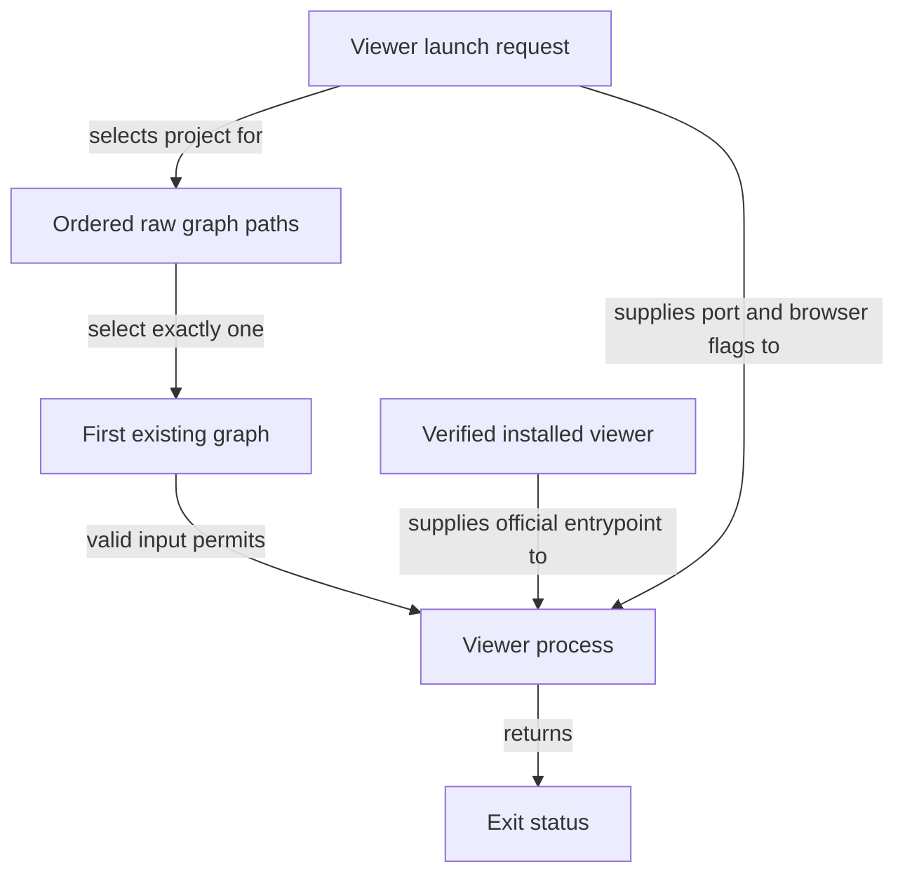

```concorde-document
{
  "id": "document.specs.modules.concorde.viewer.module",
  "targets": [
    "module.viewer"
  ],
  "main_visible": true
}
```

# Code viewer

Open an existing Understand Anything code graph with the verified installed viewer.

## Contract identity and context

`module.viewer` follows Spec Protocol 2.0.0. Its sole structural parent is `module.concorde`. The complete contract is the Markdown collection explicitly registered in `.concorde/specs.json`; links and realization references do not expand it. This reading entry introduces the collection.

The registered companion documents explain [interfaces](interfaces.md). Their content remains authoritative regardless of navigation visibility.

## Architecture

Authored source: `specs/modules/concorde/viewer/module.md` (the Mermaid fence in this section). Kind: `mermaid`. Title: **Code viewer entities and relationships**. The source is included through this document’s explicit membership; it is not a separate external diagram record.



A launch request identifies a project and optional viewer flags. The ordered graph-path list selects the first existing raw graph; validation checks that selected file, never falling through after an invalid first match. The installed manifest and receipt identify the official runtime and entrypoint.

Once both graph and runtime are admitted, a child viewer process runs from the project directory. Its exit status is the launch result, with separate CLI, preflight and interruption errors. The graph is an observation supplied by another tool; this Module neither generates it nor proves its freshness or agreement with the project's intended architecture.

## Features

### feature.viewer.launch

For an existing raw knowledge graph and verified installed viewer, select the first existing graph in configured order, validate its shape and launch the official viewer with the requested port/browser behavior. Return its exit code. Invalid first-choice data, unsafe paths or missing runtime fail without fallback to another graph, graph generation or dependency installation.

## Interfaces

### interface.viewer.use

scripts/run-viewer.py accepts a project root, optional port and no-open flag. It checks the ordered raw graph inputs and runtime identity, then launches the official viewer and returns its exit code. It does not generate the graph, install dependencies or establish that code agrees with its Spec.

The [local interface contract](interfaces.md) defines accepted inputs, outputs, effects, errors and compatibility. A successful shape check alone does not establish successful execution or a complete business contract.

## Local collaboration agreements

These entries describe the exact direct providers and children registered for this Module. They state relied-upon behavior without importing another Module’s documents.

```concorde-dependencies
[
  {
    "target_id": "module.managed-runtime",
    "responsibility": "Provision and verify the pinned Python and viewer runtime used by installed integrations.",
    "selection_condition": "When obtaining verified installed Python or viewer resources.",
    "relied_upon_promises": [
      "load_runtime_spec reads locked requirements. plan_runtime describes provisioning state. provision_runtime stages versioned, hash-bound inputs and records verified receipts. A failed acquisition does not replace a previously valid runtime or accept a partial installation."
    ]
  }
]
```

## Realizations

The registered realizations are `implementation.viewer-launcher`. They describe exact file ownership and internal implementation choices separately. Module/Feature/Interface selection includes this full contract collection and does not load those Implementation Specs. Code writing and dedicated code review use their separately declared Framework authority.
