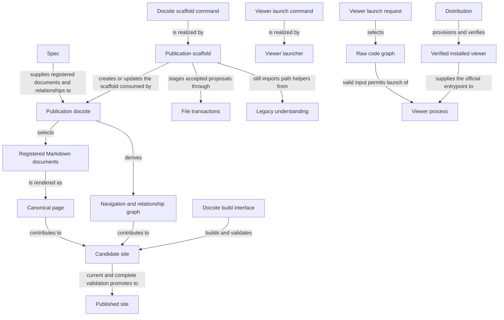

```concorde-document
{
  "id": "document.views.module",
  "targets": [
    "module.views"
  ],
  "main_visible": true
}
```

# Views

Publish registered Module Specs as a navigable documentation site, and open an existing Understand Anything code graph with the verified installed viewer.

## Purpose

Views turns the project's explicit Spec registry into a documentation site that developers and
reviewers read, and separately lets a developer open an already-produced code-structure graph in
the official Understand Anything viewer. Its publishing promises stop at rendering registered
Markdown faithfully: it derives pages, navigation and relationship edges only from the registry,
and it never infers a Module's completeness or correctness from a diagram, a route or a rendered
page. Its viewer promises stop at admission and launch: it does not generate the graph it opens,
does not judge whether that graph still agrees with the code, and does not grant an agent any
access beyond its own host-bound Spec context.

## Scenarios

Scenario definitions for the docsite scaffold and top-level publish behavior are registered in
[publication](publication.md). Scenario definitions for the registry-loading, materialization and
build/promotion pipeline are registered in [pipeline](pipeline.md). Scenario definitions for the
viewer launch command are registered in [viewer](viewer.md).

## Requirements

- req.views.no-directory-scanning: Publication SHALL derive pages and navigation only from the explicit registry and SHALL NOT discover Spec documents by scanning directories or following links.
- req.views.one-page-per-document: A physical Spec document SHALL publish at exactly one canonical page regardless of how many Modules register it.
- req.views.no-agent-context-grant: A rendered page or generated view SHALL NOT itself grant an agent invocation additional Spec context beyond its own host-bound target snapshot.
- req.views.diagram-source-identity: An inline Mermaid fence in a Module's Architecture section SHALL be its sole authored diagram source; publication SHALL create no external diagram record or `generated/diagrams` output.
- req.views.production-preview-isolation: A production build SHALL NOT clear or overwrite the development preview's generated directory.

## Entities

The three programs below realize scaffolding, publication and viewer launch; the interface
entities are their means of use; the remaining entities name the publication and viewer data the
scenarios exchange. `module.views` is also the sole owner of the retained Profile 7 legacy package,
listed below as a pending-removal entity.

```concorde-entities
[
  {
    "id": "entity.views.publication-docsite",
    "title": "Publication docsite",
    "kind": "program",
    "responsibility": "Realizes registry-driven Markdown publication: materializes one canonical page and inline Mermaid rendering per physical document, derives navigation and the relationship graph, binds a candidate to exact source digests and route coverage, and promotes only a complete current candidate while preserving the previous successful build on failure.",
    "files": [
      "docsite/README.md",
      "docsite/docusaurus.config.ts",
      "docsite/package-lock.json",
      "docsite/package.json",
      "docsite/plugins/concorde-content/diagrams.ts",
      "docsite/plugins/concorde-content/graph.ts",
      "docsite/plugins/concorde-content/index.ts",
      "docsite/plugins/concorde-content/links.ts",
      "docsite/plugins/concorde-content/manifest.ts",
      "docsite/plugins/concorde-content/registry.ts",
      "docsite/plugins/concorde-content/routes.ts",
      "docsite/plugins/concorde-content/site-identity.ts",
      "docsite/plugins/concorde-content/types.ts",
      "docsite/plugins/concorde-content/validation.ts",
      "docsite/plugins/scoped-content/build-freshness.ts",
      "docsite/plugins/scoped-content/index.ts",
      "docsite/plugins/scoped-content/materialize.ts",
      "docsite/plugins/scoped-content/model.ts",
      "docsite/plugins/scoped-content/projections.ts",
      "docsite/scaffold/deploy-docsite.yml",
      "docsite/scripts/build.ts",
      "docsite/scripts/inspect.ts",
      "docsite/scripts/materialize-content.ts",
      "docsite/scripts/prepare-publication.ts",
      "docsite/scripts/render-diagrams.ts",
      "docsite/scripts/start.ts",
      "docsite/scripts/validate.ts",
      "docsite/sidebars.architecture.ts",
      "docsite/sidebars.features.ts",
      "docsite/sidebars.protocol.ts",
      "docsite/sidebars.specs.ts",
      "docsite/site.json",
      "docsite/src/components/ArchitectureView.tsx",
      "docsite/src/components/ContentProvenance.tsx",
      "docsite/src/components/FeatureGraph.tsx",
      "docsite/src/components/FeatureNeighborhood.tsx",
      "docsite/src/components/FeatureRelations.tsx",
      "docsite/src/components/ScopedGraph.tsx",
      "docsite/src/css/custom.css",
      "docsite/src/pages/graph.tsx",
      "docsite/src/pages/index.tsx",
      "docsite/src/theme/DocItem/Layout/index.tsx",
      "docsite/src/theme/MDXComponents/index.tsx",
      "docsite/src/types/cytoscape-fcose.d.ts",
      "docsite/static/img/favicon.svg",
      "docsite/tests/contract/build-interface.test.ts",
      "docsite/tests/contract/build-manifest.test.ts",
      "docsite/tests/contract/content-sources.test.ts",
      "docsite/tests/contract/feature-graph.test.ts",
      "docsite/tests/fixtures/interfaces/build-manifest.example.json",
      "docsite/tests/fixtures/interfaces/build-manifest.schema.json",
      "docsite/tests/fixtures/interfaces/feature-graph.example.json",
      "docsite/tests/fixtures/interfaces/feature-graph.schema.json",
      "docsite/tests/fixtures/invalid-projects/broken-link/specs/example/architecture.md",
      "docsite/tests/fixtures/invalid-projects/duplicate-id/specs/example/architecture.md",
      "docsite/tests/fixtures/invalid-projects/duplicate-id/specs/example/features/001-one.md",
      "docsite/tests/fixtures/invalid-projects/duplicate-id/specs/example/features/002-two.md",
      "docsite/tests/fixtures/invalid-projects/feature-diagram/specs/example/architecture.md",
      "docsite/tests/fixtures/invalid-projects/feature-diagram/specs/example/features/001-diagram.md",
      "docsite/tests/fixtures/invalid-projects/legacy-control-state/specs/example/architecture.md",
      "docsite/tests/fixtures/invalid-projects/legacy-control-state/specs/example/attempts/feature.fixture.legacy-control/plan.md",
      "docsite/tests/fixtures/invalid-projects/legacy-control-state/specs/example/features/001-legacy-control.md",
      "docsite/tests/fixtures/invalid-projects/legacy-control-state/specs/example/reflections.md",
      "docsite/tests/fixtures/invalid-projects/legacy-residue/specs/example/architecture.md",
      "docsite/tests/fixtures/invalid-projects/legacy-residue/specs/example/features/001-legacy.md",
      "docsite/tests/fixtures/invalid-projects/legacy-residue/specs/example/features/001-legacy/abstract.md",
      "docsite/tests/fixtures/invalid-projects/legacy-residue/specs/example/features/001-legacy/contracts/example/contract.md",
      "docsite/tests/fixtures/invalid-projects/legacy-residue/specs/example/features/001-legacy/implementation.md",
      "docsite/tests/fixtures/invalid-projects/missing-architecture/specs/features/001-orphan.md",
      "docsite/tests/fixtures/invalid-projects/missing-feature/specs/example/architecture.md",
      "docsite/tests/fixtures/invalid-projects/missing-title/specs/example/architecture.md",
      "docsite/tests/fixtures/invalid-projects/nested-feature/specs/example/architecture.md",
      "docsite/tests/fixtures/invalid-projects/nested-feature/specs/example/features/001-parent.md",
      "docsite/tests/fixtures/invalid-projects/nested-feature/specs/example/features/001-parent/subfeatures/001-child.md",
      "docsite/tests/fixtures/invalid-projects/parallel-docs/docs/guide.md",
      "docsite/tests/fixtures/invalid-projects/route-collision/specs/one/architecture.md",
      "docsite/tests/fixtures/invalid-projects/route-collision/specs/two/architecture.md",
      "docsite/tests/fixtures/valid-project/.concorde/attempts/feature.fixture.alpha/plan.md",
      "docsite/tests/fixtures/valid-project/.concorde/config.json",
      "docsite/tests/fixtures/valid-project/.concorde/reflections/log.md",
      "docsite/tests/fixtures/valid-project/.concorde/reflections/plans/R-001.md",
      "docsite/tests/fixtures/valid-project/README.md",
      "docsite/tests/fixtures/valid-project/specs/example/architecture.md",
      "docsite/tests/fixtures/valid-project/specs/example/diagrams/fixture-level-view.json",
      "docsite/tests/fixtures/valid-project/specs/example/features/001-alpha.md",
      "docsite/tests/fixtures/valid-project/specs/example/modules/nested/architecture.md",
      "docsite/tests/fixtures/valid-project/specs/example/modules/nested/features/002-beta.md",
      "docsite/tests/integration/accessibility.test.ts",
      "docsite/tests/integration/atomic-promotion.test.ts",
      "docsite/tests/integration/diagram-delivery.test.ts",
      "docsite/tests/integration/document-authoring.test.ts",
      "docsite/tests/integration/feature-publication.test.ts",
      "docsite/tests/integration/performance.test.ts",
      "docsite/tests/integration/source-immutability.test.ts",
      "docsite/tests/repository/diagram-inventory.test.ts",
      "docsite/tests/repository/feature-graph.test.ts",
      "docsite/tests/repository/framework-guides.test.ts",
      "docsite/tests/repository/fresh-project-scaffold.test.ts",
      "docsite/tests/repository/github-pages.test.ts",
      "docsite/tests/repository/production-build.test.ts",
      "docsite/tests/scoped-registry.test.ts",
      "docsite/tests/setup.ts",
      "docsite/tests/unit/architecture-sources.test.ts",
      "docsite/tests/unit/build-freshness.test.ts",
      "docsite/tests/unit/diagram-delivery.test.ts",
      "docsite/tests/unit/feature-designs.test.ts",
      "docsite/tests/unit/graph.test.ts",
      "docsite/tests/unit/links.test.ts",
      "docsite/tests/unit/materialize-content.test.ts",
      "docsite/tests/unit/projections.test.ts",
      "docsite/tests/unit/registry.test.ts",
      "docsite/tests/unit/site-identity.test.ts",
      "docsite/tsconfig.json",
      "docsite/vitest.config.ts"
    ]
  },
  {
    "id": "entity.views.publication-scaffold",
    "title": "Publication scaffold",
    "kind": "program",
    "responsibility": "Realizes exact docsite scaffold proposals and deploys the current publishing template for a registered project, without reading code to infer architecture.",
    "files": [
      "src/concorde/autodocs/__init__.py",
      "src/concorde/autodocs/docsite_scaffold.py",
      "src/concorde/autodocs/docsite_template.py",
      "tests/concorde/autodocs/__init__.py",
      "tests/concorde/autodocs/integration/__init__.py",
      "tests/concorde/autodocs/integration/test_docsite_scaffold.py",
      "tests/concorde/autodocs/unit/__init__.py",
      "tests/concorde/autodocs/unit/test_docsite_template.py"
    ]
  },
  {
    "id": "entity.views.viewer-launcher",
    "title": "Viewer launcher",
    "kind": "program",
    "responsibility": "Realizes the deterministic admission and process-launch boundary that selects the first existing raw graph, verifies the installed runtime and launches the official viewer without generating the graph or installing dependencies.",
    "files": [
      "scripts/run-viewer.py",
      "tests/concorde/distribution/unit/test_viewer_launcher.py"
    ]
  },
  {
    "id": "entity.views.file-transactions",
    "title": "File transactions",
    "kind": "shared program",
    "responsibility": "Realizes exact replacement proposals as staged filesystem operations with before-digest checks and original-byte recovery, for every Module that applies an accepted proposal.",
    "files": [
      "src/concorde/specification/changes.py"
    ]
  },
  {
    "id": "entity.views.legacy-understanding",
    "title": "Legacy understanding",
    "kind": "legacy program (pending removal)",
    "responsibility": "Retains the Profile 7 project repository, validators, alignment explorer and feature-workspace delivery tools and their fixtures until their remaining importers migrate to Profile 10 equivalents; it supplies no cognitive input to any Agent. Its four live importers are the maintenance CLI's validate subcommand and scripts/reflections_queue.py (both call validate_project), src/concorde/reflections/validation.py (RepositoryError and safe_relative_path), and this Module's own publication scaffold (ProjectRepository).",
    "files": [
      "src/concorde/lifecycle/__init__.py",
      "src/concorde/lifecycle/delivery.py",
      "src/concorde/projection.py",
      "src/concorde/understanding/__init__.py",
      "src/concorde/understanding/alignment.py",
      "src/concorde/understanding/context.py",
      "src/concorde/understanding/feature_workspace.py",
      "src/concorde/understanding/initialize.py",
      "src/concorde/understanding/planning_context.py",
      "src/concorde/understanding/readiness.py",
      "src/concorde/understanding/repository.py",
      "src/concorde/understanding/validate.py",
      "src/concorde/understanding/validation/__init__.py",
      "src/concorde/understanding/validation/diagrams.py",
      "src/concorde/understanding/validation/entities.py",
      "src/concorde/understanding/validation/features.py",
      "src/concorde/understanding/validation/freshness.py",
      "src/concorde/understanding/validation/hierarchy.py",
      "src/concorde/understanding/validation/layout.py",
      "tests/concorde/PROFILE8_TEST_MIGRATION.md",
      "tests/concorde/fixtures/ask/questions.json",
      "tests/concorde/fixtures/context-project/.concorde/config.json",
      "tests/concorde/fixtures/context-project/specs/example/architecture.md",
      "tests/concorde/fixtures/context-project/specs/example/diagrams/delivery-sequence.json",
      "tests/concorde/fixtures/context-project/specs/example/diagrams/level-view.json",
      "tests/concorde/fixtures/context-project/specs/example/features/001-deliver.md",
      "tests/concorde/fixtures/context-project/specs/example/modules/api/architecture.md",
      "tests/concorde/fixtures/context-project/specs/example/modules/api/diagrams/level-view.json",
      "tests/concorde/fixtures/context-project/specs/example/modules/api/features/001-invoke.md",
      "tests/concorde/fixtures/context-project/specs/example/modules/api/modules/store/architecture.md",
      "tests/concorde/fixtures/context-project/specs/example/modules/api/modules/store/diagrams/system-overview.json",
      "tests/concorde/fixtures/interfaces/alignment/alignment-explorer.example.json",
      "tests/concorde/fixtures/interfaces/alignment/alignment-explorer.schema.json",
      "tests/concorde/fixtures/interfaces/alignment/alignment-input.example.json",
      "tests/concorde/fixtures/interfaces/alignment/alignment-input.schema.json",
      "tests/concorde/fixtures/interfaces/alignment/knowledge-graph.example.json",
      "tests/concorde/fixtures/interfaces/alignment/knowledge-graph.schema.json",
      "tests/concorde/fixtures/interfaces/workspace/architecture-service.schema.json",
      "tests/concorde/fixtures/interfaces/workspace/context-response.json",
      "tests/concorde/fixtures/interfaces/workspace/deliver-eligible-response.json",
      "tests/concorde/fixtures/interfaces/workspace/deliver-proposal.json",
      "tests/concorde/fixtures/interfaces/workspace/feature-workspace.schema.json",
      "tests/concorde/fixtures/interfaces/workspace/validation-response.json",
      "tests/concorde/fixtures/invalid-projects/broken-reference/seed.json",
      "tests/concorde/fixtures/invalid-projects/contract/seed.json",
      "tests/concorde/fixtures/invalid-projects/cycle/seed.json",
      "tests/concorde/fixtures/invalid-projects/duplicate-id/seed.json",
      "tests/concorde/fixtures/invalid-projects/parse/seed.json",
      "tests/concorde/fixtures/invalid-projects/reflections-malformed/.concorde/reflections/index.json",
      "tests/concorde/fixtures/invalid-projects/reflections-malformed/.concorde/reflections/pending/R-001.md",
      "tests/concorde/fixtures/invalid-projects/reflections-malformed/.concorde/reflections/pending/R-002.md",
      "tests/concorde/fixtures/invalid-projects/reflections-malformed/.concorde/reflections/planned/R-003.md",
      "tests/concorde/fixtures/invalid-projects/reflections-malformed/README.md",
      "tests/concorde/fixtures/invalid-projects/reflections-malformed/seed.json",
      "tests/concorde/fixtures/invalid-projects/scenario/seed.json",
      "tests/concorde/fixtures/invalid-projects/view-depth/seed.json",
      "tests/concorde/fixtures/permission-planning-project/.concorde/attempts/feature.example.consumer.change/tasks.md",
      "tests/concorde/fixtures/permission-planning-project/.concorde/attempts/feature.example.other/secret.md",
      "tests/concorde/fixtures/permission-planning-project/.concorde/config.json",
      "tests/concorde/fixtures/permission-planning-project/.concorde/constitution.md",
      "tests/concorde/fixtures/permission-planning-project/.concorde/feature.json",
      "tests/concorde/fixtures/permission-planning-project/.concorde/reflections/log.md",
      "tests/concorde/fixtures/permission-planning-project/specs/example/architecture.md",
      "tests/concorde/fixtures/permission-planning-project/specs/example/modules/consumer/architecture.md",
      "tests/concorde/fixtures/permission-planning-project/specs/example/modules/consumer/features/001-change.md",
      "tests/concorde/fixtures/permission-planning-project/specs/example/modules/provider/architecture.md",
      "tests/concorde/fixtures/permission-planning-project/specs/example/modules/provider/features/001-api.md",
      "tests/concorde/fixtures/permission-planning-project/specs/example/modules/provider/features/002-unrelated.md",
      "tests/concorde/fixtures/permission-planning-project/src/consumer/service.py",
      "tests/concorde/fixtures/permission-planning-project/src/provider/private.py",
      "tests/concorde/fixtures/permission-planning-project/tests/consumer/test_service.py",
      "tests/concorde/fixtures/permission-planning-project/tests/provider/test_private.py",
      "tests/concorde/fixtures/two-level-project/.concorde/attempts/feature.example.checkout.authorize/plan.md",
      "tests/concorde/fixtures/two-level-project/.concorde/config.json",
      "tests/concorde/fixtures/two-level-project/.specify/feature.json",
      "tests/concorde/fixtures/two-level-project/specs/example/architecture.md",
      "tests/concorde/fixtures/two-level-project/specs/example/diagrams/system-overview.json",
      "tests/concorde/fixtures/two-level-project/specs/example/features/001-checkout.md",
      "tests/concorde/fixtures/two-level-project/specs/example/features/002-atomic.md",
      "tests/concorde/fixtures/two-level-project/specs/example/features/003-authorize-payment.md",
      "tests/concorde/fixtures/two-level-project/specs/example/features/004-confirm-order.md",
      "tests/concorde/fixtures/valid-project/.concorde/config.json",
      "tests/concorde/fixtures/valid-project/specs/example/architecture.md",
      "tests/concorde/fixtures/valid-project/specs/example/diagrams/level-view.json",
      "tests/concorde/fixtures/valid-project/specs/example/features/001-deliver.md",
      "tests/concorde/fixtures/valid-project/specs/example/modules/api/architecture.md",
      "tests/concorde/fixtures/valid-project/specs/example/modules/api/diagrams/system-overview.json",
      "tests/concorde/fixtures/valid-project/specs/example/modules/api/features/001-invoke.md",
      "tests/concorde/lifecycle/__init__.py",
      "tests/concorde/lifecycle/contract/__init__.py",
      "tests/concorde/lifecycle/integration/__init__.py",
      "tests/concorde/lifecycle/integration/test_implementation_delivery.py",
      "tests/concorde/support/feature_workspace.py",
      "tests/concorde/understanding/__init__.py",
      "tests/concorde/understanding/acceptance/__init__.py",
      "tests/concorde/understanding/contract/__init__.py",
      "tests/concorde/understanding/contract/test_alignment_explorer_contract.py",
      "tests/concorde/understanding/contract/test_feature_workspace_contract.py",
      "tests/concorde/understanding/integration/__init__.py",
      "tests/concorde/understanding/integration/test_alignment_explorer.py",
      "tests/concorde/understanding/integration/test_architecture_readiness.py",
      "tests/concorde/understanding/integration/test_context.py",
      "tests/concorde/understanding/integration/test_feature_workspace.py",
      "tests/concorde/understanding/integration/test_initialize.py",
      "tests/concorde/understanding/integration/test_validation.py",
      "tests/concorde/understanding/unit/__init__.py",
      "tests/concorde/understanding/unit/test_abstract_rules.py",
      "tests/concorde/understanding/unit/test_alignment.py",
      "tests/concorde/understanding/unit/test_contract_validation.py",
      "tests/concorde/understanding/unit/test_entity_rules.py",
      "tests/concorde/understanding/unit/test_feature_relations.py",
      "tests/concorde/understanding/unit/test_feature_rules.py",
      "tests/concorde/understanding/unit/test_feature_workspace.py",
      "tests/concorde/understanding/unit/test_frontmatter.py",
      "tests/concorde/understanding/unit/test_interface_rules.py",
      "tests/concorde/understanding/unit/test_module_diagram_rules.py",
      "tests/concorde/understanding/unit/test_planning_context.py",
      "tests/concorde/understanding/unit/test_repository.py",
      "tests/concorde/understanding/unit/test_rules.py",
      "tests/concorde/understanding/unit/test_summary_rules.py",
      "tests/concorde/understanding/unit/test_terminology_rules.py"
    ]
  },
  {
    "id": "entity.views.spec",
    "title": "Spec",
    "kind": "used module",
    "target_id": "module.spec",
    "responsibility": "Supplies the explicit registry, document memberships and relationships that publication renders, without recursive filename discovery."
  },
  {
    "id": "entity.views.distribution",
    "title": "Distribution",
    "kind": "used module",
    "target_id": "module.distribution",
    "responsibility": "Provisions and verifies the official viewer package inside the managed runtime that the viewer launcher checks before starting a launch."
  },
  {
    "id": "entity.views.docsite-scaffold-command",
    "title": "Docsite scaffold command",
    "kind": "interface",
    "responsibility": "The deterministic `concorde docsite --propose`/`--apply` command that creates and applies an accepted project-relative scaffold proposal under the host's worktree policy, checking before-digests and owning only scaffold files."
  },
  {
    "id": "entity.views.docsite-build-interface",
    "title": "Docsite build interface",
    "kind": "interface",
    "responsibility": "The TypeScript isScoped/loadScopedRegistry/materializeScoped/buildSite/promoteCandidate functions and Docusaurus plugin hooks, plus the project-local npm run validate/npm run build commands, that load the registry, stage Markdown and navigation, build and validate a candidate and promote only a checked result."
  },
  {
    "id": "entity.views.viewer-launch-command",
    "title": "Viewer launch command",
    "kind": "interface",
    "responsibility": "The `python3 .../scripts/run-viewer.py --project-root PATH [--port N] [--no-open]` command that admits an existing raw graph and a verified runtime and launches the official viewer, returning its process exit code."
  },
  {
    "id": "entity.views.markdown-documents",
    "title": "Registered Markdown documents",
    "kind": "concept",
    "responsibility": "Every physical Spec document explicitly registered in the project's Spec registry, including documents shared by several Modules, which publication renders without directory scanning."
  },
  {
    "id": "entity.views.canonical-page",
    "title": "Canonical page",
    "kind": "record",
    "responsibility": "The one rendered page a registered physical document publishes at its readable derived route, carrying its membership, aliases and content digest even when the document is shared by several Modules."
  },
  {
    "id": "entity.views.navigation",
    "title": "Navigation and relationship graph",
    "kind": "concept",
    "responsibility": "The primary directory-mirroring sidebar, the secondary Module-composition view and the composes/uses/required-interface edges, all derived from the registry rather than from links or directory scanning."
  },
  {
    "id": "entity.views.candidate-site",
    "title": "Candidate site",
    "kind": "record",
    "responsibility": "The staged build whose exact source digest, route inventory and diagram rendering are validated against the current registry before promotion is considered."
  },
  {
    "id": "entity.views.published-site",
    "title": "Published site",
    "kind": "concept",
    "responsibility": "The previously promoted build that a validation failure or a source change during generation leaves untouched, so only a complete current candidate ever replaces it."
  },
  {
    "id": "entity.views.viewer-request",
    "title": "Viewer launch request",
    "kind": "concept",
    "responsibility": "One invocation of the viewer launch command with its project root and optional port/no-open flags."
  },
  {
    "id": "entity.views.code-graph",
    "title": "Raw code graph",
    "kind": "external observation",
    "responsibility": "The first existing knowledge-graph JSON file in the manifest's ordered graph_paths, an observation produced by another tool that the launcher admits by shape but does not generate, rewrite or check for freshness against source."
  },
  {
    "id": "entity.views.verified-viewer-runtime",
    "title": "Verified installed viewer",
    "kind": "concept",
    "responsibility": "The runtime marker and viewer package identity that Distribution's managed runtime provisions and that the launcher checks before starting the official viewer."
  },
  {
    "id": "entity.views.viewer-process",
    "title": "Viewer process",
    "kind": "concept",
    "responsibility": "The launched official-viewer child process, run from the project directory with the requested flags, whose exit code (or 130 on interruption) the launcher returns."
  }
]
```

## Architecture

Publication scaffold and Publication docsite touch disjoint files and never edit each other's
output: the scaffold's own exact-file transaction creates or updates project structure, and
rendering project Specs never authorizes editing them. A candidate is promoted only when it is both
complete and current; any invalid link, diagram or stale source during generation leaves the
published site exactly as it was. The viewer side is independent of publication: it admits an
existing graph and a verified runtime and launches a process, and it proves nothing about whether
that graph still agrees with the Specs this same Module publishes.



## Dependencies and composition

```concorde-dependencies
[
  {
    "target_id": "module.spec",
    "responsibility": "Supply the explicit registry, document memberships and relationships that publication renders.",
    "selection_condition": "When materializing pages, navigation or the relationship graph.",
    "relied_upon_promises": [
      "Every registered document has exactly one identity and an explicit membership list, and relationships are declared rather than inferred, so a page and its edges can be derived without reading source code."
    ]
  },
  {
    "target_id": "module.distribution",
    "responsibility": "Provision and verify the official viewer package inside the managed runtime.",
    "selection_condition": "When launching the viewer.",
    "relied_upon_promises": [
      "A verified runtime receipt identifies the exact viewer entrypoint, and a missing or unverified runtime is reported rather than substituted."
    ]
  }
]
```

## Unresolved information

The retained Profile 7 legacy understanding package (`src/concorde/understanding/**`,
`src/concorde/lifecycle/delivery.py`, `src/concorde/projection.py`, their tests and fixtures) is a
pending removal: it supplies no cognitive input to any Profile 10 Agent and is listed only under
this Module. Four call sites still import from it — two owned by `module.reflections`
(`src/concorde/reflections/validation.py` and `scripts/reflections_queue.py`), one owned by
`module.distribution` (`src/concorde/host/cli.py`'s `validate` subcommand), and one owned by this
Module (`src/concorde/autodocs/docsite_scaffold.py`'s use of `ProjectRepository`). Removal requires
migrating all four to `validate_repository` and the typed-value safe-path helpers before this
package and its fixtures can be deleted; until then it must not be extended, and its fixtures are
not live project Specs.
