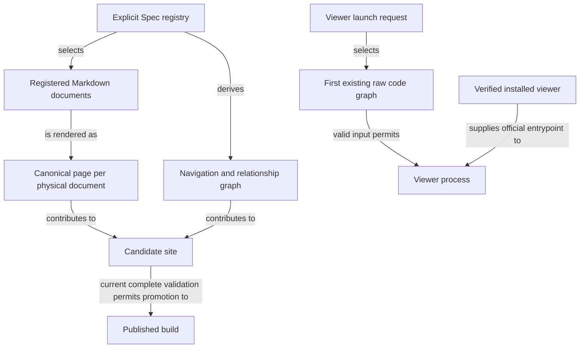

```concorde-document
{
  "id": "document.views.module",
  "targets": [
    "module.views"
  ],
  "main_visible": true
}
```

# Views

Publish registered Module and Implementation Specs as a navigable documentation site, and open an existing Understand Anything code graph with the verified installed viewer.

## Contract identity and context

`module.views` follows Spec Protocol 2.1.0. Its sole structural parent is `module.concorde`. The complete contract is the Markdown collection explicitly registered in `.concorde/specs.json`; links and realization references do not expand it. This reading entry introduces the collection.

The registered companion documents explain [publication](publication.md), [pipeline](pipeline.md) and [viewer](viewer.md). Their content remains authoritative regardless of navigation visibility.

## Architecture

Authored source: `specs/modules/concorde/views/module.md` (the Mermaid fence in this section). Kind: `mermaid`. Title: **Views entities and relationships**. The source is included through this document’s explicit membership; it is not a separate external diagram record.



Publication materializes pages, path-based navigation, target navigation and graph edges from registered sources; a candidate manifest binds those views to exact source bytes and route coverage, and the build promotes a complete current candidate while preserving the previous successful output on failure. Scaffold proposals have their own exact-file transaction; rendering project Specs never authorizes editing them. The viewer validates the first configured graph and the installed runtime, then runs the official viewer from the project directory; it neither generates the graph nor proves that code agrees with its Spec.

## Features

### feature.views.publish

For an explicitly registered project, create or update an accepted documentation scaffold and derive one canonical page per physical Spec, navigation and relationship views. Render Mermaid source inside its owning Markdown page. Promote only a complete candidate tied to current source bytes; invalid links, diagrams or stale build inputs preserve the previous published build.

### feature.views.viewer

For an existing raw knowledge graph and verified installed viewer, select the first existing graph in configured order, validate its shape and launch the official viewer with the requested port and browser behavior. Return its exit code. Invalid first-choice data, unsafe paths or a missing runtime fail without fallback to another graph, graph generation or dependency installation.

## Interfaces

### interface.views.build

`concorde docsite` proposes and applies site scaffolding. The site reads registry schema 2 and builds pages, navigation and relationship views from registered sources. Module composition, dependencies and implementation reuse are distinct edges. Each Module opens its `module.md`. Implementation pages expose their file bindings and using Modules. Only a complete current candidate is promoted. The [publication](publication.md) and [pipeline](pipeline.md) documents define inputs, outputs, effects and errors.

### interface.views.viewer

`scripts/run-viewer.py` accepts a project root, optional port and no-open flag. It checks the ordered raw graph inputs and runtime identity, then launches the official viewer and returns its exit code. It does not generate the graph, install dependencies or establish that code agrees with its Spec. The [viewer](viewer.md) document defines the launch contract.

## Local collaboration agreements

These entries describe the exact direct providers registered for this Module. They state relied-upon behavior from this Module's perspective without importing another Module's documents.

```concorde-dependencies
[
  {
    "target_id": "module.spec",
    "responsibility": "Supply the explicit registry, document memberships and relationships that publication renders.",
    "selection_condition": "When materializing pages, navigation or the relationship graph.",
    "relied_upon_promises": [
      "Every registered document has exactly one identity and an explicit membership list, and relationships are declared rather than inferred, so a page and its edges can be derived without reading source code."
    ]
  },
  {
    "target_id": "module.distribution",
    "responsibility": "Provision and verify the official viewer package inside the managed runtime.",
    "selection_condition": "When launching the viewer.",
    "relied_upon_promises": [
      "A verified runtime receipt identifies the exact viewer entrypoint, and a missing or unverified runtime is reported rather than substituted."
    ]
  }
]
```

## Realizations

The registered realizations are `implementation.publication-docsite`, `implementation.publication-scaffold`, `implementation.viewer-launcher`, `implementation.file-transactions` and `implementation.legacy-understanding`. They describe exact file ownership and internal implementation choices separately; the legacy realization is a pending removal that the scaffold still imports. Module/Feature/Interface selection includes this full contract collection and does not load those Implementation Specs.
