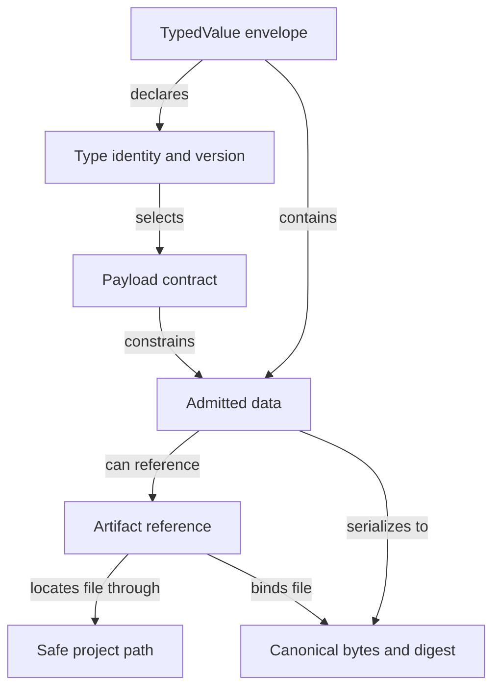

```concorde-document
{
  "id": "document.specs.modules.concorde.wire-contracts.module",
  "targets": [
    "module.wire-contracts"
  ],
  "main_visible": true
}
```

# Wire contracts

Admit versioned structured values, offline schemas and safe project paths.

## Contract identity and context

`module.wire-contracts` follows Spec Protocol 2.0.0. Its sole structural parent is `module.concorde`. The complete contract is the Markdown collection explicitly registered in `.concorde/specs.json`; links and realization references do not expand it. This reading entry introduces the collection.

The registered companion documents explain [interfaces](interfaces.md). Their content remains authoritative regardless of navigation visibility.

## Architecture

Authored source: `specs/modules/concorde/wire-contracts/module.md` (the Mermaid fence in this section). Kind: `mermaid`. Title: **Wire contracts entities and relationships**. The source is included through this document’s explicit membership; it is not a separate external diagram record.



A type identity selects one versioned payload contract. TypedValue admission checks the closed envelope, registered shape and contextual constraints; canonical encoding creates deterministic bytes but does not validate business meaning. A structured interface schema uses the explicitly supported offline vocabulary.

A project path identifies one safe relative location beneath the caller's trusted root. An artifact reference adds an identity and digest of existing regular-file bytes. Path validation and artifact freshness prevent aliases or stale references; neither reference grants read authority. Schema export is a derived representation of the admitted contracts, not a replacement for contextual validation.

## Features

### feature.wire-contracts.provide

For a named registered wire type, structured contract schema or project path, validate the declared version, shape and contextual path rules and return a validated value or precise failure. Canonical serialization and artifact digests provide reproducible byte identities. Unknown types, duplicate JSON keys, unsupported schemas and unsafe paths fail without network resolution or fallback authority.

## Interfaces

### api.wire.validate

TypedValue envelopes identify a type, version and data. Unknown fields, unsupported identities and malformed values fail admission. File-path helpers reject traversal and aliases. Schema validation is deterministic and offline; a validation error never grants a different context or fallback authority.

The [local interface contract](interfaces.md) defines accepted inputs, outputs, effects, errors and compatibility. A successful shape check alone does not establish successful execution or a complete business contract.

## Boundary

This leaf Module has no registered child or direct software-Module dependency. Caller-supplied values and external runtime resources do not become structural children.

## Realizations

The registered realizations are `implementation.wire-contracts`. They describe exact file ownership and internal implementation choices separately. Module/Feature/Interface selection includes this full contract collection and does not load those Implementation Specs. Code writing and dedicated code review use their separately declared Framework authority.
