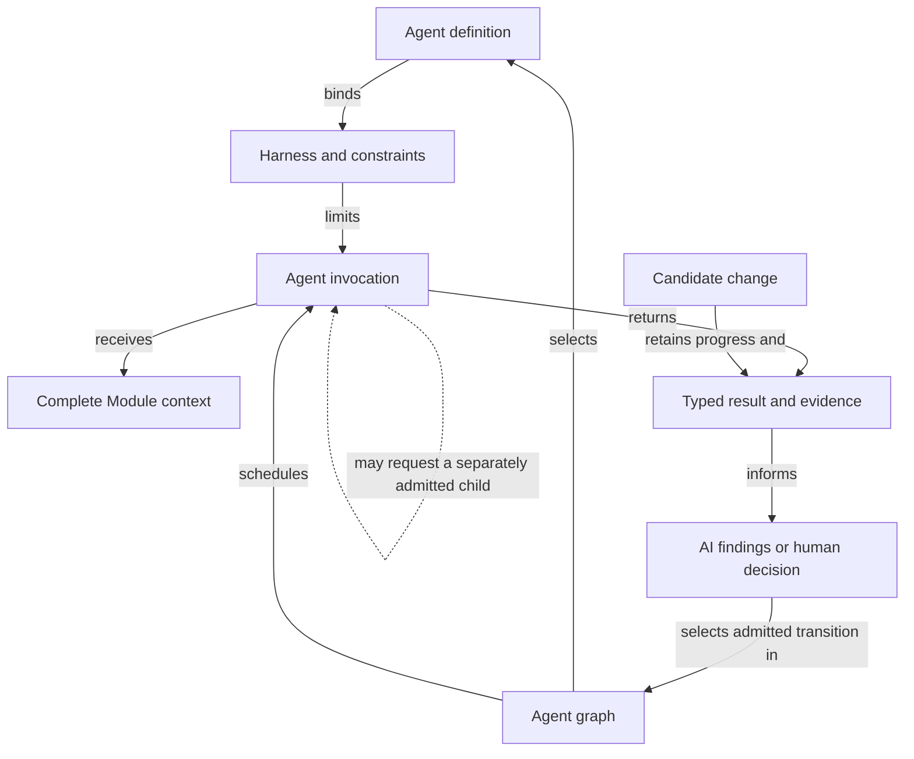

```concorde-document
{
  "id": "document.specs.modules.concorde.workflows.module",
  "targets": [
    "module.workflows"
  ],
  "main_visible": true
}
```

# Agent workflows

Route tasks and coordinate specification, planning, coding, review, topology changes and delivery.

## Contract identity and context

`module.workflows` follows Spec Protocol 2.0.0. Its sole structural parent is `module.concorde`. The complete contract is the Markdown collection explicitly registered in `.concorde/specs.json`; links and realization references do not expand it. This reading entry introduces the collection.

The registered companion documents explain [interfaces](interfaces.md), [capabilities](capabilities.md), [query-and-routing](query-and-routing.md), [development](development.md), [topology](topology.md), [review-and-gaps](review-and-gaps.md), [delivery](delivery.md), [agents-and-harnesses](agents-and-harnesses.md), [graphs-and-loops](graphs-and-loops.md), [runtime-values](runtime-values.md), [values](values.md). Their content remains authoritative regardless of navigation visibility.

## Architecture

Authored source: `specs/modules/concorde/workflows/module.md` (the Mermaid fence in this section). Kind: `mermaid`. Title: **Agent workflows entities and relationships**. The source is included through this document’s explicit membership; it is not a separate external diagram record.



An Agent definition binds authored responsibilities, a Harness and constraints. A graph names allowed invocations and transitions; each invocation binds one task, complete context, effective authority and fresh identity. The graph retains typed results and attributed feedback, while private contexts stay local to each invocation.

A candidate owns component progress, gaps and evidence. Reviews refer to the exact candidate inputs they assessed. A code defect can select the bounded task/implementation repair edge; a necessary contract gap waits for a contract revision. Finalization includes every affected user of shared implementation. Readiness, authorized delivery and cleanup are separate completion states.

## Features

### feature.workflow.execute

For an installed global or lifecycle Skill, admit its versioned request, select its declared execution graph and bind each Agent invocation to current instructions, context and authority. Return a typed capability result with distinct admission, domain and execution outcomes. Unregistered stages cannot be called as public Skills; stale inputs or unenforceable permissions prevent launch.

### feature.workflows.query

For a question and optional routing hints, Python resolves explicitly selected complete Module Spec contexts and injects deduplicated original document and diagram bodies directly into the coordinator. The coordinator reasons across those contexts and returns an answer with attributed gaps or limitations without authoring project files. A routing hint cannot grant context, and discovery stops at its declared limits.

### feature.workflows.develop

For one intended change, coordinate Spec authoring when enabled, configured reviews, sufficiency assessment, plan, tasks, implementation and checks. A successful result is a ready candidate with current evidence for all affected implementation users. Preserve drafts on failure; code-review repairs are bounded, and unchanged blocking feedback cannot loop indefinitely.

### feature.workflows.topology

For a change to identities, composition, dependencies, membership or realization bindings, prepare a registry design and separately authored local contracts. Bind developer acceptance first to the design and then to the complete application artifact. Conflicting shared bytes or stale preconditions reject application; successful application updates the accepted structure and sources together.

### feature.workflows.deliver

For an authorized ready change selected by change_id, verify participation, candidate evidence and actual integration, publish an independent concorde/delivered/<change_id> branch and remove the source unless explicitly retained. Default delivery preserves the primary branch, index and project files. Only a separate explicitly user-authorized merge_primary:true request from the primary owning session may merge into its checked-out branch after current integration checks. One agent owns primary writes; repository locking serializes shared lifecycle writes and final merges. Record branch delivery, cleanup and primary merging separately for safe retries.

## Interfaces

### interface.workflows.use

The public boundary is a versioned TypedValue invocation of an installed concorde-* Skill. Global calls select the owning Module; lifecycle calls perform declared deterministic actions. A planner determines tasks from the selected Module Spec alone. Code writers additionally receive referenced Implementation Specs. Each stage reports its own completion and gaps; a completed component does not independently deliver the enclosing change.

The [local interface contract](interfaces.md) defines accepted inputs, outputs, effects, errors and compatibility. A successful shape check alone does not establish successful execution or a complete business contract.

## Local collaboration agreements

These entries describe the exact direct providers and children registered for this Module. They state relied-upon behavior without importing another Module’s documents.

```concorde-dependencies
[
  {
    "target_id": "module.spec-context",
    "responsibility": "Resolve complete Module contracts, bind code-writing implementation context and validate explicit Spec structure.",
    "selection_condition": "When resolving a complete Module context or preparing initial project Spec state.",
    "relied_upon_promises": [
      "resolve_context selects one Module and its complete registered documents. resolve_discovery_context deterministically resolves several explicitly selected complete Module contexts, with deduplicated original document and diagram bodies and per-Module membership for direct coordinator reasoning. Feature focus never trims the collection. Non-code phases do not receive Implementation Specs or implementation source. The implementation phase adds only the referenced Implementation Specs and exact bound files. Membership, bytes, rules and admitted stage inputs determine context identity."
    ]
  },
  {
    "target_id": "module.registry",
    "responsibility": "Admit Module and Implementation identities, resolve document collections and look up exact file ownership and reuse.",
    "selection_condition": "When resolving identities, document membership or exact implementation users.",
    "relied_upon_promises": [
      "SpecRepository reads registry schema 2. select returns a Module descriptor. Implementation records form a separate index, file_implementations maps each declared file to one owner, and implementation_users maps each Implementation Spec to all using Modules. Lookups never follow a relationship to read another Spec body."
    ]
  },
  {
    "target_id": "module.wire-contracts",
    "responsibility": "Admit versioned structured values, offline schemas and safe project paths.",
    "selection_condition": "When admitting typed values, offline schemas, digests or safe paths.",
    "relied_upon_promises": [
      "TypedValue envelopes identify a type, version and data. Unknown fields, unsupported identities and malformed values fail admission. File-path helpers reject traversal and aliases. Schema validation is deterministic and offline; a validation error never grants a different context or fallback authority."
    ]
  },
  {
    "target_id": "module.file-transactions",
    "responsibility": "Apply exact multi-file changes with before-digest checks and rollback.",
    "selection_condition": "When applying exact proposed file replacements with current preconditions.",
    "relied_upon_promises": [
      "file_change captures a current before-digest. apply_files accepts exact allowed paths, stages changes, rechecks originals and invokes verification. Invalid or stale preflight causes no replacement. A later failure restores changed original bytes and removes transaction-created files when recovery I/O succeeds; recovery failure remains explicit. Proposed content cannot expand the allowed set."
    ]
  },
  {
    "target_id": "module.agent-execution",
    "responsibility": "Execute separately bound Agent invocations through their Harness and admit typed results.",
    "selection_condition": "When running a separately admitted Agent and receiving its typed completion.",
    "relied_upon_promises": [
      "AgentProcessExecutor accepts a host-built LaunchSpecification, verifies the Agent/Harness binding and effective policy, starts the selected model integration and validates completion evidence. Exit code alone does not establish completion. Recursive invocations retain independent context, limits and typed handoffs."
    ]
  },
  {
    "target_id": "module.permissions",
    "responsibility": "Compile declared effects and host authority into reproducible execution permissions.",
    "selection_condition": "When compiling or verifying the effective permissions of a host-bound launch.",
    "relied_upon_promises": [
      "compile_policy intersects role paths and caller authority. Native renderers establish the resulting read, write, command and network boundaries or reject unsupported enforcement. Only a code-writing invocation may write its bound implementation files and admitted Implementation Spec documents; Module contracts remain immutable in that phase."
    ]
  },
  {
    "target_id": "module.package-assets",
    "responsibility": "Build deterministic Agent, Skill, Protocol, schema and documentation assets from authored sources.",
    "selection_condition": "When loading current generated instructions and their source-bound Agent definitions.",
    "relied_upon_promises": [
      "build renders assets; write_build writes owned projections; check_build compares without changing the worktree. verify_fresh detects changed authoring sources. Module and Implementation kind definitions are distributed together. Generated assets are derived outputs and are never independent authoring sources."
    ]
  },
  {
    "target_id": "module.reflections",
    "responsibility": "Retain, investigate and resolve explicitly attributed project feedback and persistent gaps.",
    "selection_condition": "When exposing or explicitly capturing attributed development gaps.",
    "relied_upon_promises": [
      "The triage boundary selects explicit records by Module or local feature/interface identity. Status is read-only. Investigation runs in a separately bound code invocation. Verified findings and developer disposition determine further work; ordinary feedback does not automatically create a Reflection or enlarge its owner."
    ]
  }
]
```

## Realizations

The registered realizations are `implementation.workflow-host`, `implementation.workflow-capabilities`, `implementation.agent-definitions`, `implementation.worktree-lifecycle`. They describe exact file ownership and internal implementation choices separately. Module/Feature/Interface selection includes this full contract collection and does not load those Implementation Specs. Code writing and dedicated code review use their separately declared Framework authority.
