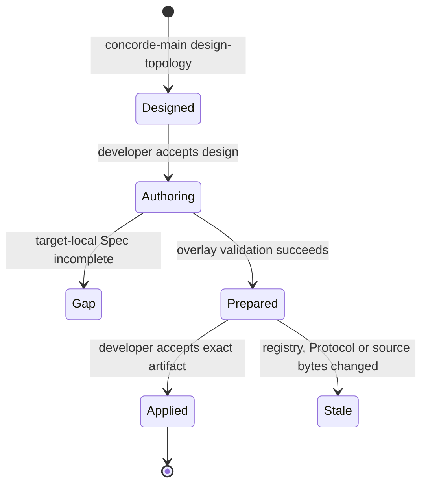

```concorde-document
{
  "id": "document.workflow.topology",
  "targets": [
    "module.workflows"
  ],
  "main_visible": true
}
```

# Topology evolution Agent Graph

Use this Graph when registered targets, document membership, shared truth or routing structure
must change together. The developer supplies intended behavior and constraints. Main designs a
candidate registry; fresh target-local authors supply the affected Specs after design acceptance.
A second acceptance binds the exact prepared transaction before application.

Human acceptance is a Graph control input tied to the exact design or prepared application. A
rejection may select another design or authoring loop, but cannot authorize the rejected effects.
The loop waits for a required decision and re-admits revised intent and current source identity.
Coordinator and target-author invocations retain separate Agent definitions and Harness bindings.

## Stages and outcomes




No target author writes project files. A gap or disagreement over exact shared bytes leaves the
pre-design project unchanged. Prepared
artifacts contain full proposed bytes, but only their path/digest enters coordinator cognition.
Application is one host transaction with current before-digests and final repository validation.


Every new Module includes a local `module.md` and a declared System overview. Its author returns
both Markdown and diagram source changes within that Module's registered paths. The host checks
all proposed files as one overlay before exposing the prepared application. Diagram JSON cannot
be used to widen Spec membership or agent permissions.
